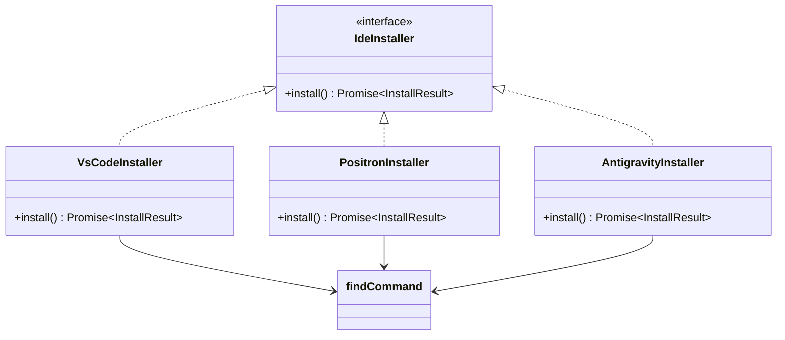

# ide-installer.ts

> IDE 伴侣扩展的自动安装器，支持 VS Code、Positron 和 Antigravity

## 概述

本文件实现了面向不同 IDE 的伴侣扩展安装逻辑。采用策略模式，通过工厂函数 `getIdeInstaller` 根据 IDE 类型返回对应的安装器实例。每个安装器负责：

1. 查找 IDE 的 CLI 命令（PATH 搜索 + 常见安装路径探测）
2. 使用 CLI 的 `--install-extension` 命令安装 `google.gemini-cli-vscode-ide-companion` 扩展

## 架构图



## 主要导出

### `IdeInstaller` (接口)

```typescript
export interface IdeInstaller {
  install(): Promise<InstallResult>;
}
```

### `InstallResult` (接口)

```typescript
export interface InstallResult {
  success: boolean;
  message: string;
}
```

### `getIdeInstaller(ide, platform?): IdeInstaller | null`

工厂函数，根据 IDE 类型返回对应安装器：
- `vscode` / `firebasestudio` -> `VsCodeInstaller`
- `positron` -> `PositronInstaller`
- `antigravity` -> `AntigravityInstaller`
- 其他 -> `null`

## 核心逻辑

### `findCommand(command, platform)`

命令查找的两阶段策略：
1. **PATH 搜索**: Unix 使用 `command -v`，Windows 使用 `where.exe`
2. **常见路径探测**: 按平台检查固定安装位置
   - macOS: `/Applications/`, `~/Library/Application Support/`
   - Linux: `/usr/share/`, `/snap/bin/`, `~/.local/share/`
   - Windows: `%ProgramFiles%/`, `%LOCALAPPDATA%/Programs/`

### 安装器实现

三个安装器类共享相似的逻辑：
1. 构造时异步查找 CLI 命令路径
2. `install()` 执行 `{command} --install-extension google.gemini-cli-vscode-ide-companion --force`
3. Windows 下使用 `shell: true` 以支持 `.cmd` 扩展名

`AntigravityInstaller` 特殊处理：优先使用 `ANTIGRAVITY_CLI_ALIAS` 环境变量（经安全正则验证），回退到 `agy` / `antigravity` 命令。

## 内部依赖

| 模块 | 用途 |
|------|------|
| `detect-ide.ts` | `IDE_DEFINITIONS`, `IdeInfo` 类型 |
| `constants.ts` | `GEMINI_CLI_COMPANION_EXTENSION_NAME` |
| `../utils/paths.js` | `homedir()` |

## 外部依赖

| 包 | 用途 |
|---|------|
| `node:child_process` | `execSync`, `spawnSync` |
| `node:process` | 平台检测 |
| `node:path` | 路径拼接 |
| `node:fs` | `existsSync` |
