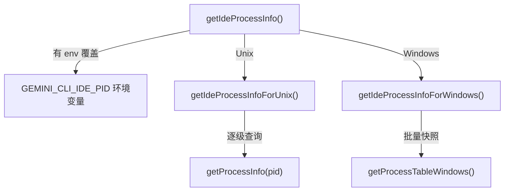

# process-utils.ts

> 跨平台的进程树遍历工具，用于定位 IDE 主进程的 PID 和命令行

## 概述

本文件通过向上遍历进程树来定位启动 CLI 的 IDE 主进程。不同操作系统采用不同策略：

- **Unix**: 逐级向上查找父进程，遇到 shell 进程后取其祖父进程（跳过 IDE 的 ptyhost 中间层）
- **Windows**: 一次性获取完整进程表快照，在内存中遍历祖先链

检测到的 IDE 进程 PID 用于后续查找连接配置文件（文件名中包含 PID）。

## 架构图



## 主要导出

### `getIdeProcessInfo(): Promise<{ pid: number; command: string }>`

主入口函数，返回 IDE 进程的 PID 和完整命令行。

优先级：
1. 如果设置了 `GEMINI_CLI_IDE_PID` 环境变量，直接使用该 PID
2. Windows 走 `getIdeProcessInfoForWindows()`
3. 其他平台走 `getIdeProcessInfoForUnix()`

## 核心逻辑

### Unix 策略 (`getIdeProcessInfoForUnix`)

1. 从当前进程 PID 开始，逐级向上遍历（最多 32 层）
2. 遇到 shell 进程（zsh/bash/sh/fish 等）时，取其父进程的父进程（祖父进程），因为 shell 的直接父进程通常是 IDE 的 ptyhost 工具进程
3. 如果祖父进程 PID <= 1（systemd/launchd），回退到直接父进程
4. 使用 `ps -o ppid=,command= -p {pid}` 命令获取进程信息

### Windows 策略 (`getIdeProcessInfoForWindows`)

1. 通过 PowerShell 的 `Get-CimInstance Win32_Process` 一次性获取全部进程信息
2. 在内存中构建祖先链（最多 32 层）
3. 选择倒数第 3 个祖先（即根进程的曾孙），这通常对应 IDE 主进程

### 辅助类型

```typescript
interface ProcessInfo { pid: number; parentPid: number; name: string; command: string; }
interface RawProcessInfo { ProcessId?: number; ParentProcessId?: number; Name?: string; CommandLine?: string; }
```

## 内部依赖

无。

## 外部依赖

| 包 | 用途 |
|---|------|
| `node:child_process` | `exec`（异步执行 ps / powershell 命令） |
| `node:util` | `promisify` |
| `node:os` | `platform()` |
| `node:path` | `basename()` |
