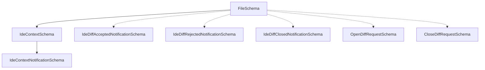

# types.ts

> IDE 集成模块的 Zod Schema 类型定义，涵盖文件、上下文、通知和请求

## 概述

本文件使用 Zod 库定义了 IDE 集成模块中所有数据交换的 Schema 和类型。这些定义被 `IdeClient` 用于注册 MCP 通知处理器以及进行运行时数据验证。文件覆盖了 IDE 上下文（打开文件、工作区状态）以及 diff 操作的请求/通知协议。

## 架构图



## 主要导出

### `FileSchema` / `File`

```typescript
export const FileSchema = z.object({
  path: z.string(),            // 文件绝对路径
  timestamp: z.number(),       // 最后聚焦时间戳
  isActive: z.boolean().optional(),    // 是否为当前活动文件
  selectedText: z.string().optional(), // 选中文本
  cursor: z.object({                   // 光标位置
    line: z.number(),          // 1-based 行号
    character: z.number(),     // 1-based 字符偏移
  }).optional(),
});
```

### `IdeContextSchema` / `IdeContext`

```typescript
export const IdeContextSchema = z.object({
  workspaceState: z.object({
    openFiles: z.array(FileSchema).optional(),  // 打开的文件列表
    isTrusted: z.boolean().optional(),           // 工作区是否受信任
  }).optional(),
});
```

### 通知 Schema

| Schema | 方法名 | 用途 |
|--------|--------|------|
| `IdeContextNotificationSchema` | `ide/contextUpdate` | IDE 上下文更新通知 |
| `IdeDiffAcceptedNotificationSchema` | `ide/diffAccepted` | Diff 被接受通知（含最终内容） |
| `IdeDiffRejectedNotificationSchema` | `ide/diffRejected` | Diff 被拒绝通知 |
| `IdeDiffClosedNotificationSchema` | `ide/diffClosed` | Diff 关闭通知（向后兼容） |

### 请求 Schema

| Schema | 用途 |
|--------|------|
| `OpenDiffRequestSchema` | 打开 diff 视图的请求参数（filePath + newContent） |
| `CloseDiffRequestSchema` | 关闭 diff 视图的请求参数（filePath + suppressNotification） |

## 核心逻辑

本文件无运行时逻辑，仅为 Schema 声明。所有 Schema 均基于 Zod 定义，并通过 `z.infer` 自动导出 TypeScript 类型。通知 Schema 遵循 JSON-RPC 2.0 格式（含 `jsonrpc: '2.0'` 和 `method` 字面量字段）。

## 内部依赖

无。

## 外部依赖

| 包 | 用途 |
|---|------|
| `zod` | 运行时 Schema 定义与类型推导 |
