# index.ts

> 核心包的统一导出入口，汇聚并重新导出所有子模块的公共 API。

## 概述

`index.ts` 是 `@anthropic/core` 包的主入口文件，采用桶文件（barrel file）模式将分散在数十个子目录中的模块统一导出。它不包含任何业务逻辑，仅通过 `export *` 和具名导出将各子模块的类型、类、函数暴露给外部消费者。这种设计使得包的使用者只需 `import { ... } from '@anthropic/core'` 即可访问所有功能，同时保持内部模块的独立组织结构。

## 架构图

```mermaid
graph TD
    subgraph "index.ts 导出聚合"
        IDX[index.ts]
    end

    IDX --> CONFIG[config/]
    IDX --> OUTPUT[output/]
    IDX --> POLICY[policy/]
    IDX --> BILLING[billing/]
    IDX --> CONFIRM[confirmation-bus/]
    IDX --> CMD[commands/]
    IDX --> CORE[core/]
    IDX --> SCHED[scheduler/]
    IDX --> FALLBACK[fallback/]
    IDX --> CODE_ASSIST[code_assist/]
    IDX --> UTILS[utils/]
    IDX --> SERVICES[services/]
    IDX --> SKILLS[skills/]
    IDX --> IDE[ide/]
    IDX --> TOOLS[tools/]
    IDX --> RESOURCES[resources/]
    IDX --> PROMPTS[prompts/]
    IDX --> AGENTS[agents/]
    IDX --> MCP[mcp/]
    IDX --> TELEMETRY[telemetry/]
    IDX --> HOOKS[hooks/]
    IDX --> VOICE[voice/]
```

## 主要导出

该文件按功能领域组织导出，涵盖以下类别：

| 类别 | 导出来源 | 说明 |
|------|----------|------|
| 配置 | `config/` | 配置管理、模型设置、内存、常量 |
| 输出 | `output/` | JSON 格式化器、流式输出类型 |
| 策略 | `policy/` | 策略引擎、TOML 加载器、完整性校验 |
| 计费 | `billing/` | AI 额度与超额计费逻辑 |
| 确认总线 | `confirmation-bus/` | 工具确认的消息总线 |
| 命令 | `commands/` | 扩展、还原、初始化、内存命令 |
| 核心逻辑 | `core/` | LLM 客户端、内容生成、日志、Token 限制 |
| 调度器 | `scheduler/` | 任务调度与工具执行 |
| 回退 | `fallback/` | 模型回退处理 |
| Code Assist | `code_assist/` | OAuth、服务器、遥测、管理控制 |
| 工具集 | `utils/` | 文件操作、Git、Shell、错误处理等通用工具 |
| 服务 | `services/` | 文件发现、Git、信任、录制等服务 |
| 技能 | `skills/` | 技能管理器与加载器 |
| IDE | `ide/` | IDE 客户端、检测、安装 |
| 工具 | `tools/` | 各种内置工具（读写文件、grep、shell 等） |
| 资源 | `resources/` | MCP 资源注册表 |
| 代理 | `agents/` | 代理类型、加载器、本地执行器 |
| MCP OAuth | `mcp/` | OAuth 提供者、令牌存储 |
| 遥测 | `telemetry/` | 遥测事件记录与会话 ID |
| 钩子 | `hooks/` | 钩子系统与类型 |
| 语音 | `voice/` | 语音响应格式化 |
| 外部类型 | `@google/genai` | `Content`, `Part`, `FunctionCall` 类型 |

## 核心逻辑

本文件无核心逻辑，纯粹是导出聚合。值得注意的模式包括：

1. **选择性具名导出**：部分模块采用具名导出而非 `export *`，例如 `homedir`/`tmpdir` 从 `utils/paths.js` 单独导出，`PolicyDecision`/`ApprovalMode` 从 `policy/types.js` 具名导出（避免与同模块的 `export *` 冲突）。
2. **类型导出**：MCP OAuth 相关的类型使用 `export type` 确保只在类型层面导出，不引入运行时代码。
3. **重复导出**：`secure-browser-launcher.js` 和 `agents/types.js` 各出现两次，属于冗余但不影响功能。

## 内部依赖

该文件依赖项目内几乎所有子模块目录，包括但不限于：
- `config/`, `output/`, `policy/`, `billing/`, `confirmation-bus/`
- `commands/`, `core/`, `scheduler/`, `fallback/`, `code_assist/`
- `utils/`, `services/`, `skills/`, `ide/`, `tools/`, `resources/`
- `prompts/`, `agents/`, `mcp/`, `telemetry/`, `hooks/`, `voice/`

## 外部依赖

| 包名 | 用途 |
|------|------|
| `@google/genai` | 导出 `Content`, `Part`, `FunctionCall` 类型 |
