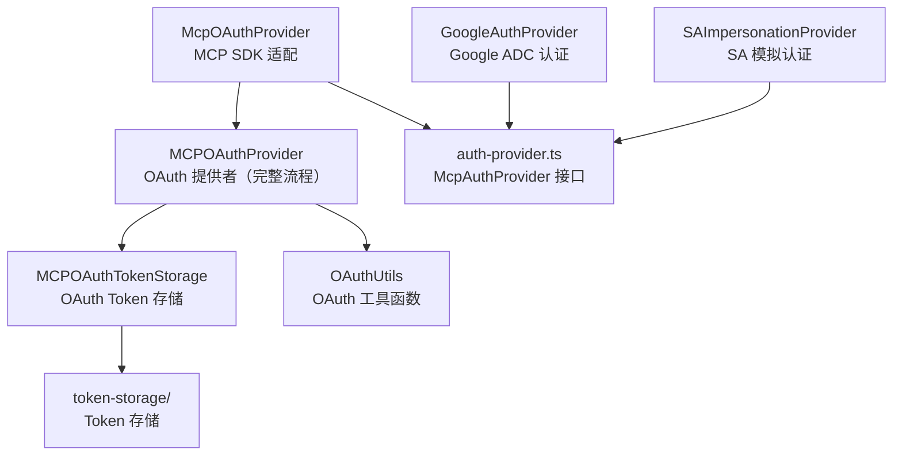

# mcp 架构

> MCP（Model Context Protocol）协议实现模块，提供 OAuth 认证、Token 管理和服务器连接能力

## 概述

`mcp/` 模块实现了 MCP 协议的客户端认证层。MCP 服务器可能要求 OAuth2 认证，该模块提供完整的 OAuth 流程支持：动态客户端注册、PKCE 授权、Token 刷新、多层 Token 存储。模块还实现了 Google ADC 认证和 Service Account 模拟（SA Impersonation）认证方式，以及 OAuth 元数据发现等辅助功能。核心的 `MCPOAuthProvider` 处理完整的 OAuth 授权流程，包括启动本地回调服务器接收授权码。

## 架构图



## 目录结构

```
mcp/
├── auth-provider.ts          # McpAuthProvider 接口（扩展 MCP SDK 的 OAuthClientProvider）
├── oauth-provider.ts         # MCPOAuthProvider：完整 OAuth2 流程实现
├── mcp-oauth-provider.ts     # McpOAuthProvider：MCP SDK 的 OAuthClientProvider 适配
├── google-auth-provider.ts   # Google ADC 认证提供者
├── sa-impersonation-provider.ts  # Service Account 模拟认证
├── oauth-token-storage.ts    # MCPOAuthTokenStorage：OAuth Token 管理
├── oauth-utils.ts            # OAuthUtils：元数据发现、URL 验证
└── token-storage/            # Token 存储实现
```

## 关键文件

| 文件 | 功能 |
|------|------|
| `oauth-provider.ts` | `MCPOAuthProvider` 类：完整 OAuth2 流程——(1) 检查已存储 Token；(2) 尝试 Token 刷新；(3) 执行新的授权流程（PKCE + 本地回调服务器）；支持动态客户端注册（RFC 7591）、`MCPOAuthConfig` 配置接口 |
| `auth-provider.ts` | `McpAuthProvider` 接口：扩展 MCP SDK 的 `OAuthClientProvider`，添加 `getRequestHeaders()` 方法支持自定义请求头注入 |
| `oauth-utils.ts` | `OAuthUtils` 类：OAuth 元数据发现（`.well-known/oauth-authorization-server`）、受保护资源元数据发现、URL 根匹配验证、`ResourceMismatchError` |
| `mcp-oauth-provider.ts` | `McpOAuthProvider`：适配 MCP SDK 的 `OAuthClientProvider` 接口，桥接到 `MCPOAuthProvider` |
| `oauth-token-storage.ts` | `MCPOAuthTokenStorage`：Token 存储管理，委托给 `token-storage/` 模块的具体实现 |

## 内部依赖

- `utils/errors.ts` - FatalCancellationError 等
- `utils/secure-browser-launcher.ts` - 打开浏览器
- `utils/authConsent.ts` - OAuth 同意
- `utils/oauth-flow.ts` - 共享的 OAuth 流程工具
- `utils/events.ts` - 核心事件
- `utils/debugLogger.ts` - 调试日志

## 外部依赖

| 依赖 | 用途 |
|------|------|
| `@modelcontextprotocol/sdk` | MCP SDK 的 OAuth 类型（OAuthClientProvider） |
| `google-auth-library` | Google ADC 和 SA 认证 |
