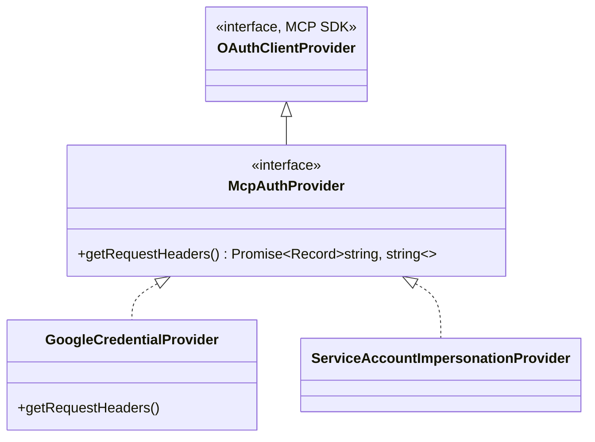

# auth-provider.ts

> MCP 认证提供者的扩展接口，支持自定义请求头注入

## 概述

本文件定义了 `McpAuthProvider` 接口，它是 MCP SDK 原生 `OAuthClientProvider` 的扩展。新增的 `getRequestHeaders()` 方法允许认证提供者向 MCP 传输层请求中注入自定义 HTTP 头。

该接口是 MCP 认证体系的基石类型，被 `GoogleCredentialProvider` 和 `ServiceAccountImpersonationProvider` 实现。

## 架构图



## 主要导出

### `McpAuthProvider` (接口)

```typescript
export interface McpAuthProvider extends OAuthClientProvider {
  getRequestHeaders?(): Promise<Record<string, string>>;
}
```

扩展了 `OAuthClientProvider`，新增可选方法 `getRequestHeaders()`，返回要附加到 MCP 请求的自定义 HTTP 头（如 `X-Goog-User-Project`）。

## 核心逻辑

本文件仅为接口声明，无运行时逻辑。

## 内部依赖

无。

## 外部依赖

| 包 | 用途 |
|---|------|
| `@modelcontextprotocol/sdk/client/auth.js` | `OAuthClientProvider` 基础接口 |
