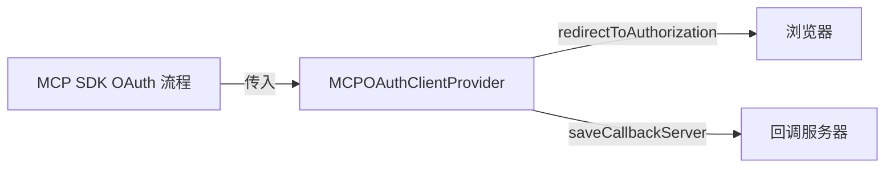

# mcp-oauth-provider.ts

> 轻量级内存 OAuth 客户端提供者，用于 MCP SDK 的 OAuth 认证流程

## 概述

`MCPOAuthClientProvider` 是 MCP SDK `OAuthClientProvider` 接口的简单内存实现。它将所有 OAuth 状态（客户端信息、令牌、code verifier、回调服务器引用）保存在内存中，不做持久化存储。

该类主要用于 MCP SDK 内部的 OAuth 流程交互，作为 SDK 要求的 provider 实例传入。

## 架构图



## 主要导出

### `OAuthAuthorizationResponse` (接口)

```typescript
export interface OAuthAuthorizationResponse {
  code: string;
  state: string;
}
```

OAuth 授权回调的响应结构。

### `MCPOAuthClientProvider` (类)

实现 `OAuthClientProvider` 接口。

| 方法 | 签名 | 用途 |
|------|------|------|
| `constructor` | `constructor(redirectUrl, clientMetadata, state?, onRedirect?)` | 初始化，接受重定向 URL、客户端元数据、state 和重定向回调 |
| `redirectUrl` | `get redirectUrl(): string \| URL` | 获取重定向 URL |
| `clientMetadata` | `get clientMetadata(): OAuthClientMetadata` | 获取客户端元数据 |
| `saveCallbackServer` | `saveCallbackServer(server): void` | 保存回调服务器引用 |
| `getSavedCallbackServer` | `getSavedCallbackServer(): CallbackServer \| undefined` | 获取已保存的回调服务器 |
| `clientInformation` | `clientInformation(): OAuthClientInformation \| undefined` | 获取客户端信息 |
| `saveClientInformation` | `saveClientInformation(info): void` | 保存客户端信息 |
| `tokens` | `tokens(): OAuthTokens \| undefined` | 获取令牌 |
| `saveTokens` | `saveTokens(tokens): void` | 保存令牌 |
| `redirectToAuthorization` | `redirectToAuthorization(url): Promise<void>` | 调用 onRedirect 回调 |
| `saveCodeVerifier` | `saveCodeVerifier(v): void` | 保存 PKCE code verifier |
| `codeVerifier` | `codeVerifier(): string` | 获取 code verifier（未保存时抛错） |
| `state` | `state(): string` | 获取 OAuth state（未保存时抛错） |

## 核心逻辑

本类是纯内存状态容器，无复杂逻辑。所有 `save*` 方法存入私有字段，对应 `get` 方法读取并返回。`redirectToAuthorization` 委托给构造函数传入的 `onRedirect` 回调（默认打印 URL 到调试日志）。

`CallbackServer` 类型定义了回调服务器的接口：
```typescript
type CallbackServer = {
  port: Promise<number>;
  waitForResponse: () => Promise<OAuthAuthorizationResponse>;
  close: () => Promise<void>;
};
```

## 内部依赖

| 模块 | 用途 |
|------|------|
| `../utils/debugLogger.js` | 默认重定向回调的日志输出 |

## 外部依赖

| 包 | 用途 |
|---|------|
| `@modelcontextprotocol/sdk/client/auth.js` | `OAuthClientProvider` 接口 |
| `@modelcontextprotocol/sdk/shared/auth.js` | OAuth 类型定义 |
