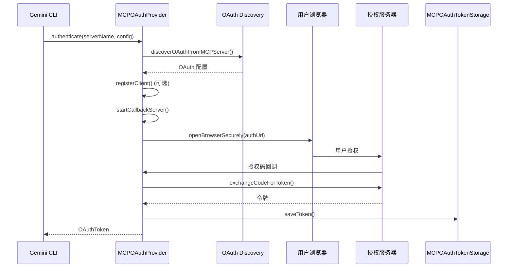

# oauth-provider.ts

> MCP 服务端 OAuth 认证的核心提供者，实现完整的 OAuth 2.0 授权码流程（含 PKCE、动态客户端注册、令牌刷新）

## 概述

`MCPOAuthProvider` 是 MCP OAuth 认证的顶层协调类，完成从配置发现到令牌获取的全流程。它整合了以下能力：

1. **OAuth 配置发现** -- 通过 RFC 9728 受保护资源元数据和 RFC 8414 授权服务器元数据自动发现 OAuth 端点
2. **动态客户端注册** -- 支持 RFC 7591 动态客户端注册（当未配置 clientId 时）
3. **PKCE 授权码流程** -- 启动本地回调服务器、打开浏览器、等待授权码、交换令牌
4. **令牌生命周期管理** -- 令牌获取、保存、过期检查、自动刷新

## 架构图



## 主要导出

### `MCPOAuthConfig` (接口)

```typescript
export interface MCPOAuthConfig {
  enabled?: boolean;
  clientId?: string;
  clientSecret?: string;
  authorizationUrl?: string;
  issuer?: string;
  tokenUrl?: string;
  scopes?: string[];
  audiences?: string[];
  redirectUri?: string;
  tokenParamName?: string;
  registrationUrl?: string;
}
```

MCP 服务端的 OAuth 配置结构。

### `OAuthClientRegistrationRequest` / `OAuthClientRegistrationResponse`

RFC 7591 动态客户端注册的请求和响应类型。

### `MCPOAuthProvider` (类)

| 方法 | 签名 | 用途 |
|------|------|------|
| `constructor` | `constructor(tokenStorage?)` | 接受可选的 `MCPOAuthTokenStorage` 实例 |
| `authenticate` | `authenticate(serverName, config, mcpServerUrl?): Promise<OAuthToken>` | 执行完整 OAuth 认证流程 |
| `getValidToken` | `getValidToken(serverName, config): Promise<string \| null>` | 获取有效令牌（自动刷新过期令牌） |
| `refreshAccessToken` | `refreshAccessToken(config, refreshToken, tokenUrl, mcpServerUrl?): Promise<OAuthTokenResponse>` | 使用 refresh token 刷新令牌 |

## 核心逻辑

### `authenticate()` 流程

1. **OAuth 发现**: 如果没有 `authorizationUrl`，先通过 HEAD 请求检查 `WWW-Authenticate` 头，再尝试标准 well-known 端点发现
2. **PKCE 参数生成**: 调用 `generatePKCEParams()` 生成 code_verifier 和 code_challenge
3. **回调服务器启动**: 提前启动本地 HTTP 服务器以分配端口
4. **动态客户端注册**: 无 clientId 时，通过 issuer 发现注册端点并执行 RFC 7591 注册
5. **用户授权**: 请求用户同意，打开浏览器跳转授权 URL
6. **令牌交换**: 接收授权码后交换为访问令牌和刷新令牌
7. **令牌存储**: 保存令牌并验证保存成功（通过 SHA-256 指纹日志确认）

### `getValidToken()` 流程

1. 从存储中读取凭据
2. 未过期 -> 直接返回访问令牌
3. 已过期且有 refresh_token -> 尝试刷新，成功则更新存储
4. 刷新失败 -> 删除无效凭据，返回 null

### Issuer 发现逻辑 (`discoverAuthServerMetadataForRegistration`)

对于包含路径的 issuer URL，智能尝试多种 well-known 端点组合，包括剥离 OIDC 协议路径后缀和版本号段。

## 内部依赖

| 模块 | 用途 |
|------|------|
| `oauth-token-storage.ts` | 令牌存储 |
| `oauth-utils.ts` | `OAuthUtils` 发现工具、`ResourceMismatchError` |
| `../utils/oauth-flow.js` | PKCE 参数、回调服务器、令牌交换等共享工具 |
| `../utils/secure-browser-launcher.js` | 安全打开浏览器 |
| `../utils/errors.js` | 错误处理 |
| `../utils/events.js` | 用户反馈事件 |
| `../utils/authConsent.js` | OAuth 授权同意交互 |
| `../utils/debugLogger.js` | 调试日志 |
| `./token-storage/types.js` | `OAuthToken` 类型 |

## 外部依赖

| 包 | 用途 |
|---|------|
| `node:crypto` | SHA-256 令牌指纹 |
| `node:url` | URL 解析 |
