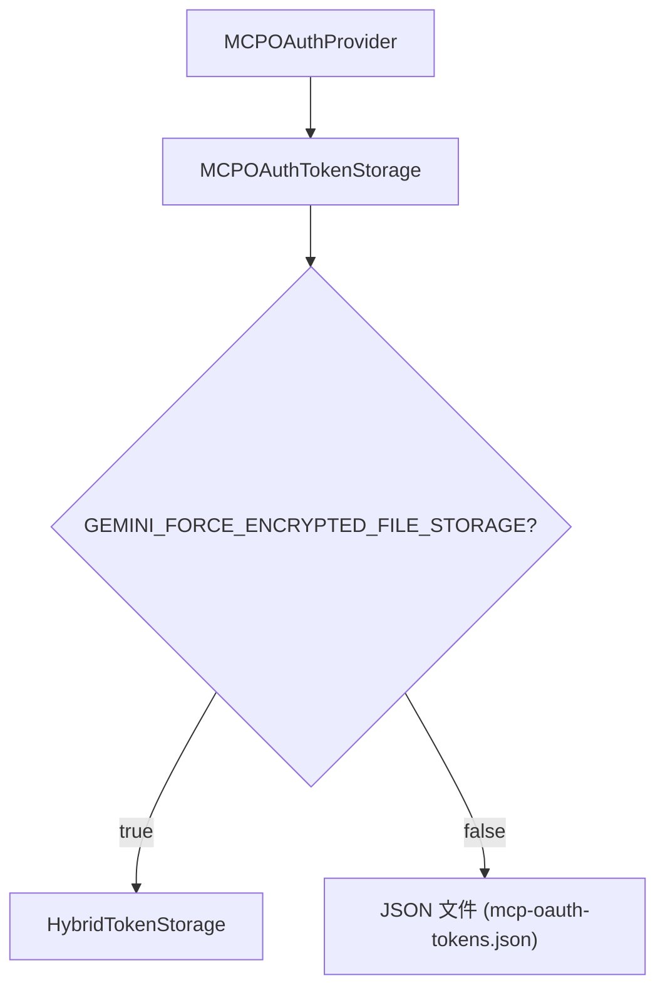

# oauth-token-storage.ts

> OAuth 令牌的持久化存储管理器，支持 JSON 文件和加密文件两种后端

## 概述

`MCPOAuthTokenStorage` 实现了 `TokenStorage` 接口，负责 MCP 和 A2A OAuth 令牌的增删改查。它提供两种存储策略：

1. **JSON 文件模式**（默认）-- 将令牌以 JSON 数组形式存储在本地文件中（权限 0o600）
2. **加密文件模式** -- 当 `GEMINI_FORCE_ENCRYPTED_FILE_STORAGE=true` 时，委托给 `HybridTokenStorage`

该类被 `MCPOAuthProvider` 使用，是令牌持久化的直接入口。

## 架构图



## 主要导出

### `MCPOAuthTokenStorage` (类)

实现 `TokenStorage` 接口。

| 方法 | 签名 | 用途 |
|------|------|------|
| `constructor` | `constructor(tokenFilePath?, serviceName?)` | 可选自定义文件路径和服务名 |
| `getAllCredentials` | `getAllCredentials(): Promise<Map<string, OAuthCredentials>>` | 获取所有凭据 |
| `listServers` | `listServers(): Promise<string[]>` | 列出所有已存储的服务名 |
| `setCredentials` | `setCredentials(credentials): Promise<void>` | 存储凭据 |
| `saveToken` | `saveToken(serverName, token, clientId?, tokenUrl?, mcpServerUrl?): Promise<void>` | 保存令牌（带元数据） |
| `getCredentials` | `getCredentials(serverName): Promise<OAuthCredentials \| null>` | 获取指定服务的凭据 |
| `deleteCredentials` | `deleteCredentials(serverName): Promise<void>` | 删除指定服务的凭据 |
| `isTokenExpired` | `isTokenExpired(token): boolean` | 检查令牌是否过期（含 5 分钟缓冲） |
| `clearAll` | `clearAll(): Promise<void>` | 清除所有令牌 |

## 核心逻辑

### 双模式存储

每个公共方法开头都检查 `useEncryptedFile` 标志：
- `true` -> 委托给 `this.hybridTokenStorage` 的对应方法
- `false` -> 使用 JSON 文件操作

### JSON 文件操作

- **读取**: 使用 `fs.readFile` 读取整个 JSON 文件，解析为 `OAuthCredentials[]` 数组，转换为 Map
- **写入**: 将 Map 转为数组，`JSON.stringify` 后写入文件，权限 `0o600`
- **删除**: 从 Map 中移除后重写文件；如果没有剩余令牌则删除整个文件
- **文件路径**: 默认使用 `Storage.getMcpOAuthTokensPath()`，也可自定义

### 令牌过期判断

```typescript
isTokenExpired(token): boolean {
  if (!token.expiresAt) return false; // 无过期时间视为有效
  const bufferMs = 5 * 60 * 1000;    // 5 分钟缓冲
  return Date.now() + bufferMs >= token.expiresAt;
}
```

## 内部依赖

| 模块 | 用途 |
|------|------|
| `./token-storage/hybrid-token-storage.js` | 加密文件存储后端 |
| `./token-storage/types.js` | `OAuthToken`, `OAuthCredentials`, `TokenStorage` |
| `./token-storage/index.js` | `DEFAULT_SERVICE_NAME`, `FORCE_ENCRYPTED_FILE_ENV_VAR` |
| `../config/storage.js` | `Storage.getMcpOAuthTokensPath()` |
| `../utils/events.js` | 错误反馈 |
| `../utils/errors.js` | `getErrorMessage` |

## 外部依赖

| 包 | 用途 |
|---|------|
| `node:fs` | 文件读写 |
| `node:path` | 目录创建 |
