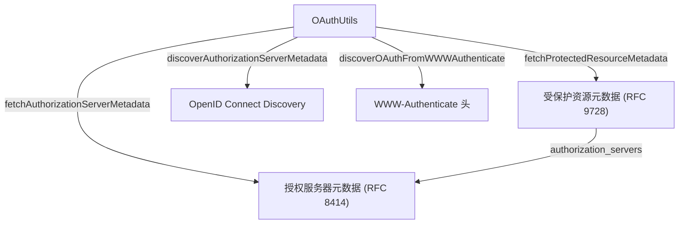

# oauth-utils.ts

> OAuth 协议工具类，实现 RFC 9728/8414 元数据发现、WWW-Authenticate 解析和 JWT 过期时间提取

## 概述

`OAuthUtils` 是一个静态工具类，封装了 OAuth 2.0 认证流程中与协议发现和元数据处理相关的通用逻辑。它被 `MCPOAuthProvider` 和 `ServiceAccountImpersonationProvider` 使用，是 MCP OAuth 子系统的协议层。

主要功能包括：
- 构建 RFC 9728 well-known URL
- 获取和解析受保护资源元数据及授权服务器元数据
- 从 `WWW-Authenticate` 响应头发现 OAuth 配置
- JWT ID Token 过期时间解析
- 资源标识符等价性验证

## 架构图



## 主要导出

### `ResourceMismatchError` (类)

```typescript
export class ResourceMismatchError extends Error
```

当发现的资源元数据中的 `resource` 字段与预期不匹配时抛出，用于防止 SSRF 攻击。

### `OAuthAuthorizationServerMetadata` (接口)

RFC 8414 授权服务器元数据结构，包含 `issuer`、`authorization_endpoint`、`token_endpoint`、`registration_endpoint` 等字段。

### `OAuthProtectedResourceMetadata` (接口)

RFC 9728 受保护资源元数据结构，包含 `resource`、`authorization_servers` 等字段。

### `FIVE_MIN_BUFFER_MS`

```typescript
export const FIVE_MIN_BUFFER_MS = 5 * 60 * 1000;
```

5 分钟缓冲常量，用于令牌过期判断。

### `OAuthUtils` (静态类)

| 方法 | 签名 | 用途 |
|------|------|------|
| `buildWellKnownUrls` | `static buildWellKnownUrls(baseUrl, useRootDiscovery?): { protectedResource, authorizationServer }` | 构建 well-known URL |
| `fetchProtectedResourceMetadata` | `static async fetchProtectedResourceMetadata(url): Promise<...>` | 获取受保护资源元数据 |
| `fetchAuthorizationServerMetadata` | `static async fetchAuthorizationServerMetadata(url): Promise<...>` | 获取授权服务器元数据 |
| `metadataToOAuthConfig` | `static metadataToOAuthConfig(metadata): MCPOAuthConfig` | 元数据转 OAuth 配置 |
| `discoverAuthorizationServerMetadata` | `static async discoverAuthorizationServerMetadata(authServerUrl): Promise<...>` | 多策略发现授权服务器元数据 |
| `discoverOAuthConfig` | `static async discoverOAuthConfig(serverUrl): Promise<MCPOAuthConfig \| null>` | 完整 OAuth 配置发现流程 |
| `parseWWWAuthenticateHeader` | `static parseWWWAuthenticateHeader(header): string \| null` | 解析 WWW-Authenticate 头中的 resource_metadata URL |
| `discoverOAuthFromWWWAuthenticate` | `static async discoverOAuthFromWWWAuthenticate(header, mcpServerUrl?): Promise<...>` | 从 WWW-Authenticate 头发现 OAuth 配置 |
| `extractBaseUrl` | `static extractBaseUrl(url): string` | 提取 URL 的 origin 部分 |
| `isSSEEndpoint` | `static isSSEEndpoint(url): boolean` | 判断是否为 SSE 端点 |
| `buildResourceParameter` | `static buildResourceParameter(url): string` | 构建 OAuth resource 参数 |
| `parseTokenExpiry` | `static parseTokenExpiry(idToken): number \| undefined` | 解析 JWT 的 exp 字段（返回毫秒） |

## 核心逻辑

### OAuth 配置发现流程 (`discoverOAuthConfig`)

1. 按 RFC 9728 构建带路径的 well-known URL 获取资源元数据
2. 失败时回退到根路径发现
3. 验证资源标识符匹配（防止 SSRF）
4. 从资源元数据的 `authorization_servers` 获取授权服务器 URL
5. 发现授权服务器元数据
6. 全失败后尝试在服务器 URL 本身上发现授权服务器元数据

### 授权服务器元数据发现 (`discoverAuthorizationServerMetadata`)

针对含路径的 issuer URL，按以下优先级尝试 5 种 well-known 端点：
1. `/.well-known/oauth-authorization-server{path}` (路径插入)
2. `/.well-known/openid-configuration{path}` (路径插入)
3. `{path}/.well-known/openid-configuration` (路径追加)
4. `/.well-known/oauth-authorization-server` (根路径)
5. `/.well-known/openid-configuration` (根路径)

### 资源标识符等价性 (`isEquivalentResourceIdentifier`)

标准化两个 URL（仅保留 protocol + host + pathname），然后做字符串精确比较。

## 内部依赖

| 模块 | 用途 |
|------|------|
| `oauth-provider.ts` | `MCPOAuthConfig` 类型 |
| `../utils/errors.js` | `getErrorMessage` |
| `../utils/debugLogger.js` | 调试日志 |

## 外部依赖

无。使用 Web 标准 `fetch` 和 `URL`。
