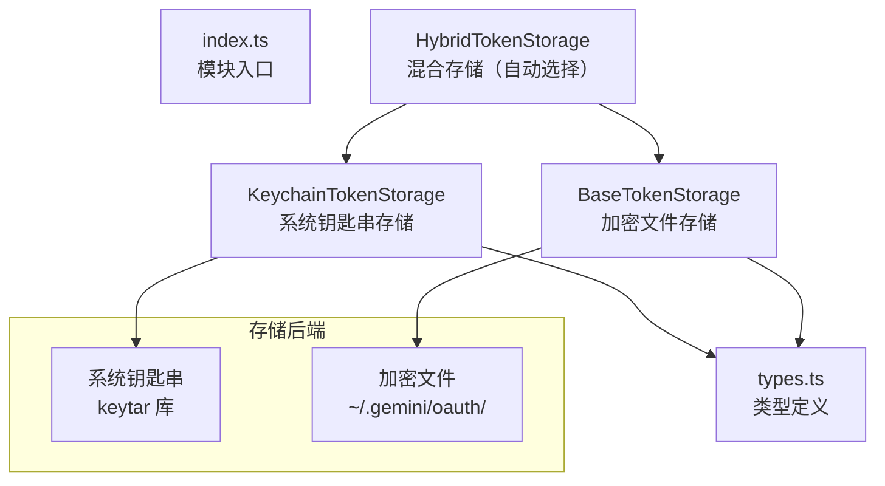

# token-storage 架构

> MCP OAuth Token 的多层持久化存储系统，支持系统钥匙串和加密文件两种后端

## 概述

`token-storage/` 模块为 MCP OAuth Token 提供安全的持久化存储能力。采用**混合存储策略**：优先使用系统钥匙串（macOS Keychain / Linux Secret Service / Windows Credential Manager），在不可用时降级为加密文件存储。`HybridTokenStorage` 自动探测并选择最佳存储后端，确保 Token 在跨会话间持久保存。

## 架构图



## 目录结构

```
token-storage/
├── index.ts                    # 模块入口，导出常量和子模块
├── types.ts                    # 类型定义（OAuthToken、TokenStorage 等）
├── hybrid-token-storage.ts     # HybridTokenStorage：自动选择存储后端
├── keychain-token-storage.ts   # KeychainTokenStorage：系统钥匙串实现
└── base-token-storage.ts       # BaseTokenStorage：加密文件实现
```

## 关键文件

| 文件 | 功能 |
|------|------|
| `types.ts` | 核心类型定义：`OAuthToken`（accessToken、refreshToken、expiresAt、tokenType、scope）、`OAuthCredentials`（serverName、token、clientId、tokenUrl、mcpServerUrl、updatedAt）、`TokenStorage` 接口（CRUD + listServers + clearAll）、`SecretStorage` 接口、`TokenStorageType` 枚举（KEYCHAIN / ENCRYPTED_FILE） |
| `hybrid-token-storage.ts` | `HybridTokenStorage`：在初始化时探测钥匙串可用性，自动选择最优后端；支持 `GEMINI_FORCE_ENCRYPTED_FILE_STORAGE` 环境变量强制使用文件存储 |
| `keychain-token-storage.ts` | `KeychainTokenStorage`：使用 `keytar` 可选依赖访问系统钥匙串，Token 以 JSON 序列化后存储 |
| `base-token-storage.ts` | `BaseTokenStorage`：将 Token 加密后写入文件系统（`~/.gemini/oauth/` 目录），支持多服务器隔离存储 |
| `index.ts` | 导出所有子模块并定义 `DEFAULT_SERVICE_NAME`（`gemini-cli-oauth`）和 `FORCE_ENCRYPTED_FILE_ENV_VAR` 常量 |

## 内部依赖

无其他 core 内部模块依赖。

## 外部依赖

| 依赖 | 用途 |
|------|------|
| `keytar` | 系统钥匙串访问（可选依赖） |
| `node:crypto` | 加密/解密（文件存储模式） |
| `node:fs` | 文件系统操作 |
