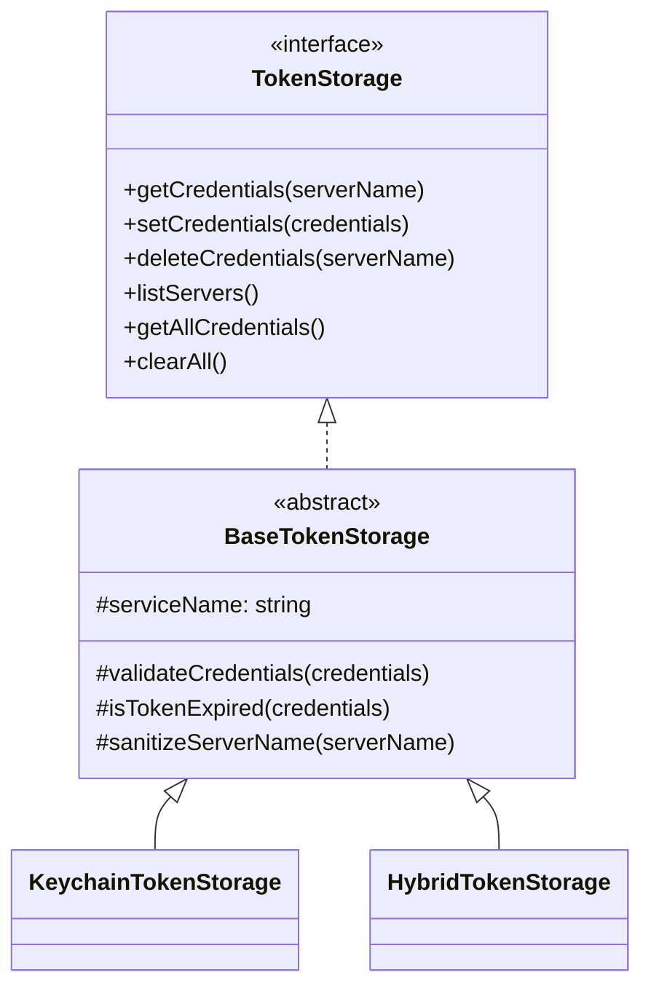

# base-token-storage.ts

> 令牌存储的抽象基类，提供凭据验证、过期检查和服务名清理等公共方法

## 概述

`BaseTokenStorage` 是 `TokenStorage` 接口的抽象实现，定义了所有具体令牌存储后端必须实现的方法，同时提供了三个受保护的工具方法供子类复用：

- 凭据完整性验证
- 令牌过期判断（带 5 分钟缓冲）
- 服务名清理（仅保留安全字符）

`KeychainTokenStorage` 和 `HybridTokenStorage` 均继承自本类。

## 架构图



## 主要导出

### `BaseTokenStorage` (抽象类)

| 成员 | 类型 | 用途 |
|------|------|------|
| `serviceName` | `protected readonly string` | 服务名标识（如 `gemini-cli-oauth`） |
| `constructor(serviceName)` | 构造函数 | 设置服务名 |

**抽象方法**（子类必须实现）:

| 方法 | 签名 |
|------|------|
| `getCredentials` | `abstract getCredentials(serverName: string): Promise<OAuthCredentials \| null>` |
| `setCredentials` | `abstract setCredentials(credentials: OAuthCredentials): Promise<void>` |
| `deleteCredentials` | `abstract deleteCredentials(serverName: string): Promise<void>` |
| `listServers` | `abstract listServers(): Promise<string[]>` |
| `getAllCredentials` | `abstract getAllCredentials(): Promise<Map<string, OAuthCredentials>>` |
| `clearAll` | `abstract clearAll(): Promise<void>` |

**受保护工具方法**:

| 方法 | 签名 | 用途 |
|------|------|------|
| `validateCredentials` | `protected validateCredentials(credentials): void` | 验证 serverName、token、accessToken、tokenType 非空 |
| `isTokenExpired` | `protected isTokenExpired(credentials): boolean` | 判断令牌是否过期（含 5 分钟缓冲） |
| `sanitizeServerName` | `protected sanitizeServerName(serverName): string` | 将非 `[a-zA-Z0-9-_.]` 字符替换为下划线 |

## 核心逻辑

### `validateCredentials`

逐项检查凭据对象的必需字段，任一缺失则抛出 `Error`：
- `credentials.serverName` 不能为空
- `credentials.token` 不能为空
- `credentials.token.accessToken` 不能为空
- `credentials.token.tokenType` 不能为空

### `isTokenExpired`

```typescript
if (!credentials.token.expiresAt) return false;
const bufferMs = 5 * 60 * 1000;
return Date.now() > credentials.token.expiresAt - bufferMs;
```

无过期时间的令牌视为永不过期。有过期时间时提前 5 分钟视为过期。

### `sanitizeServerName`

使用正则 `/[^a-zA-Z0-9-_.]/g` 将不安全字符替换为 `_`，确保服务名可安全用作 keychain 账户名或文件标识。

## 内部依赖

| 模块 | 用途 |
|------|------|
| `types.ts` | `TokenStorage`, `OAuthCredentials` |

## 外部依赖

无。
