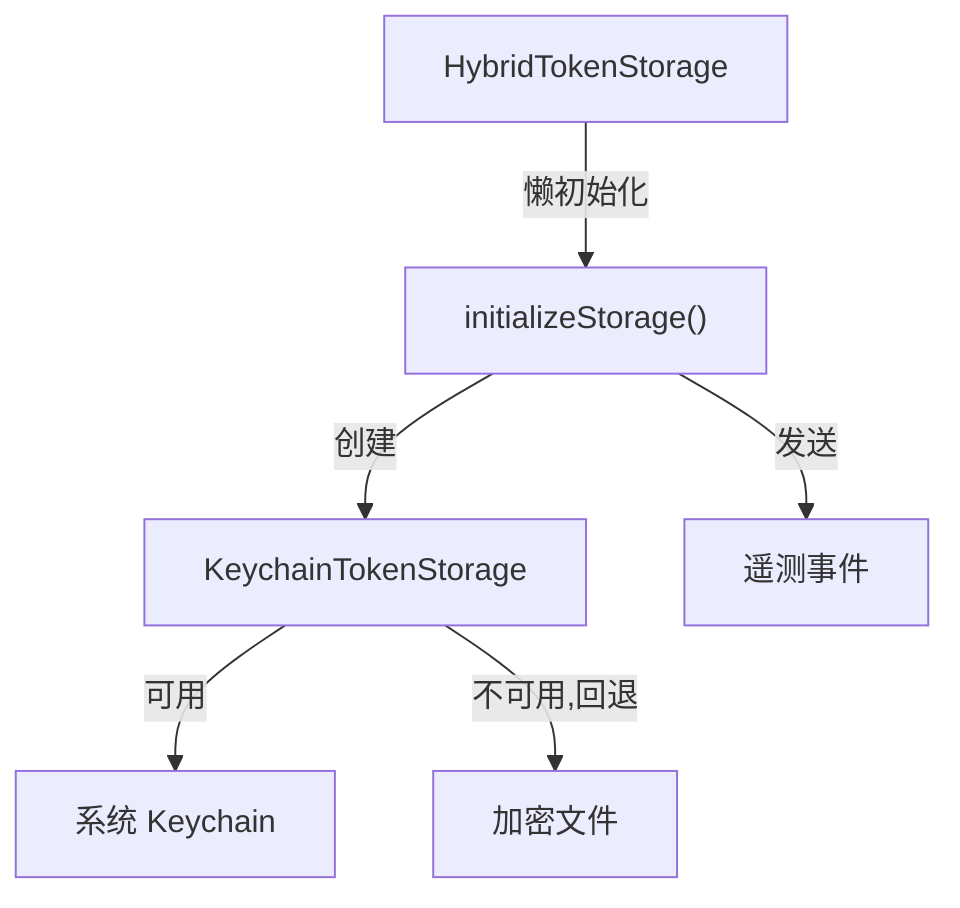

# hybrid-token-storage.ts

> 混合令牌存储，自动选择 Keychain 或加密文件后端并发送遥测事件

## 概述

`HybridTokenStorage` 继承自 `BaseTokenStorage`，采用懒初始化策略自动检测并选择最合适的存储后端。它将实际存储委托给 `KeychainTokenStorage`，后者内部会根据系统 Keychain 的可用性自动回退到加密文件存储。

初始化时会发送遥测事件，报告实际使用的存储类型（keychain 或 encrypted_file）。

## 架构图



## 主要导出

### `HybridTokenStorage` (类)

继承 `BaseTokenStorage`。

| 方法 | 签名 | 用途 |
|------|------|------|
| `constructor` | `constructor(serviceName: string)` | 传递服务名给基类 |
| `getCredentials` | `getCredentials(serverName): Promise<OAuthCredentials \| null>` | 委托给实际存储后端 |
| `setCredentials` | `setCredentials(credentials): Promise<void>` | 委托给实际存储后端 |
| `deleteCredentials` | `deleteCredentials(serverName): Promise<void>` | 委托给实际存储后端 |
| `listServers` | `listServers(): Promise<string[]>` | 委托给实际存储后端 |
| `getAllCredentials` | `getAllCredentials(): Promise<Map<string, OAuthCredentials>>` | 委托给实际存储后端 |
| `clearAll` | `clearAll(): Promise<void>` | 委托给实际存储后端 |
| `getStorageType` | `getStorageType(): Promise<TokenStorageType>` | 返回实际使用的存储类型 |

## 核心逻辑

### 懒初始化与竞态防护

```typescript
private async getStorage(): Promise<TokenStorage> {
  if (this.storage !== null) return this.storage;
  if (!this.storageInitPromise) {
    this.storageInitPromise = this.initializeStorage();
  }
  return this.storageInitPromise;
}
```

使用 `storageInitPromise` 单例 promise 确保即使并发调用也只执行一次初始化。

### 初始化流程 (`initializeStorage`)

1. 创建 `KeychainTokenStorage` 实例
2. 调用 `isUsingFileFallback()` 检测实际存储后端
3. 根据结果设置 `storageType`（`KEYCHAIN` 或 `ENCRYPTED_FILE`）
4. 发送 `TokenStorageInitializationEvent` 遥测事件，包含存储类型和是否强制使用文件存储

### 委托模式

所有 `TokenStorage` 接口方法均遵循相同模式：
```typescript
async someMethod(...args) {
  const storage = await this.getStorage();
  return storage.someMethod(...args);
}
```

## 内部依赖

| 模块 | 用途 |
|------|------|
| `base-token-storage.ts` | `BaseTokenStorage` 基类 |
| `keychain-token-storage.ts` | `KeychainTokenStorage` 实际后端 |
| `types.ts` | `TokenStorageType`, `TokenStorage`, `OAuthCredentials` |
| `../../utils/events.js` | `coreEvents` 遥测事件 |
| `../../telemetry/types.js` | `TokenStorageInitializationEvent` |
| `../../services/keychainService.js` | `FORCE_FILE_STORAGE_ENV_VAR` |

## 外部依赖

无。
