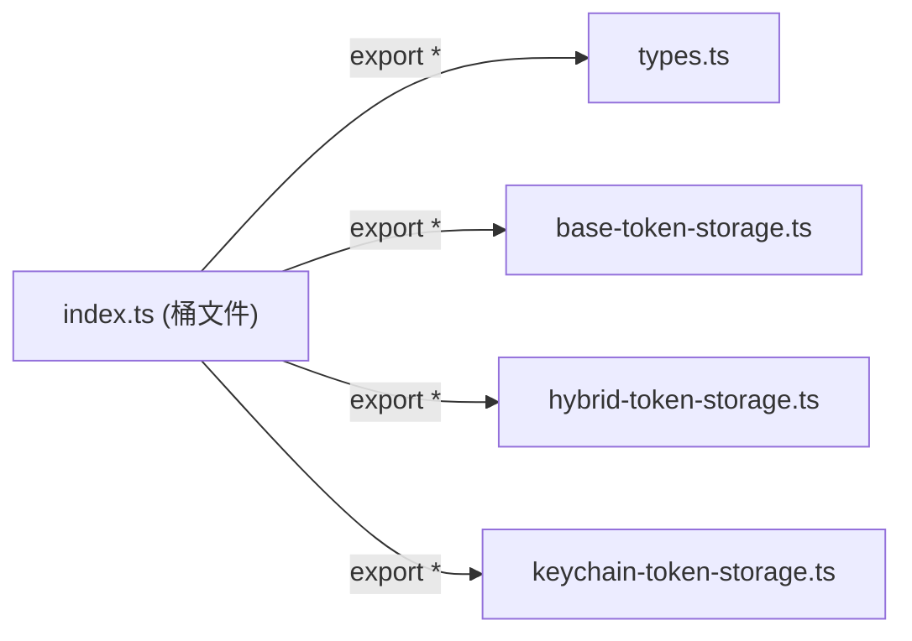

# index.ts

> token-storage 子模块的桶文件（barrel export），统一导出所有类型和实现

## 概述

本文件是 `token-storage` 子目录的入口点，使用 `export *` 语法重新导出所有子模块的公开成员，并额外定义了两个模块级常量。外部模块通过导入此文件即可访问所有令牌存储相关的类型、基类和实现。

## 架构图



## 主要导出

### 重导出

| 来源模块 | 导出内容 |
|----------|----------|
| `types.ts` | `OAuthToken`, `OAuthCredentials`, `TokenStorage`, `SecretStorage`, `TokenStorageType` |
| `base-token-storage.ts` | `BaseTokenStorage` |
| `hybrid-token-storage.ts` | `HybridTokenStorage` |
| `keychain-token-storage.ts` | `KeychainTokenStorage` |

### 本地常量

```typescript
export const DEFAULT_SERVICE_NAME = 'gemini-cli-oauth';
```

默认的 Keychain 服务名称，在未指定自定义服务名时使用。

```typescript
export const FORCE_ENCRYPTED_FILE_ENV_VAR = 'GEMINI_FORCE_ENCRYPTED_FILE_STORAGE';
```

环境变量名，设置为 `'true'` 时强制使用加密文件存储而非 Keychain。

## 核心逻辑

无运行时逻辑，纯导出文件。

## 内部依赖

| 模块 | 用途 |
|------|------|
| `types.ts` | 重导出 |
| `base-token-storage.ts` | 重导出 |
| `hybrid-token-storage.ts` | 重导出 |
| `keychain-token-storage.ts` | 重导出 |

## 外部依赖

无。
