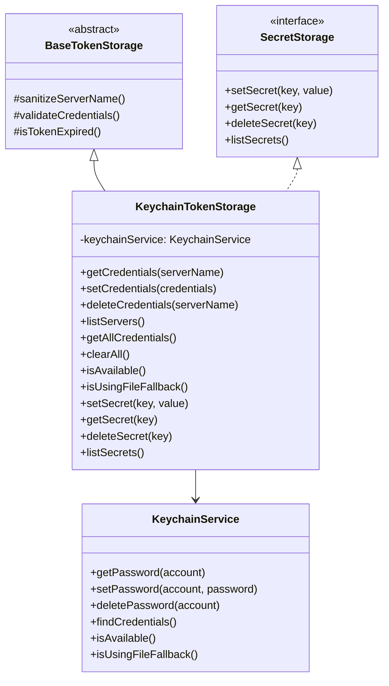

# keychain-token-storage.ts

> 基于系统 Keychain 的令牌存储实现，同时提供通用密钥存储（SecretStorage）能力

## 概述

`KeychainTokenStorage` 继承自 `BaseTokenStorage` 并实现 `SecretStorage` 接口，通过 `KeychainService`（对系统 Keychain/加密文件的抽象）提供安全的令牌持久化存储。

除了 OAuth 令牌管理，本类还提供通用的密钥-值存储功能（`setSecret`/`getSecret`/`deleteSecret`/`listSecrets`），使用 `SECRET_PREFIX` 前缀与 OAuth 凭据区分。

## 架构图

## 主要导出

### `KeychainTokenStorage` (类)

**TokenStorage 方法:**

| 方法 | 签名 | 用途 |
|------|------|------|
| `getCredentials` | `getCredentials(serverName): Promise<OAuthCredentials \| null>` | 从 keychain 读取并反序列化凭据，过期则返回 null |
| `setCredentials` | `setCredentials(credentials): Promise<void>` | 验证后序列化并存入 keychain（自动添加 updatedAt） |
| `deleteCredentials` | `deleteCredentials(serverName): Promise<void>` | 从 keychain 删除指定凭据 |
| `listServers` | `listServers(): Promise<string[]>` | 列出所有非测试、非密钥的凭据账户名 |
| `getAllCredentials` | `getAllCredentials(): Promise<Map<string, OAuthCredentials>>` | 获取所有未过期的凭据 |
| `clearAll` | `clearAll(): Promise<void>` | 逐个删除所有凭据 |

**SecretStorage 方法:**

| 方法 | 签名 | 用途 |
|------|------|------|
| `setSecret` | `setSecret(key, value): Promise<void>` | 存储带 `SECRET_PREFIX` 前缀的密钥 |
| `getSecret` | `getSecret(key): Promise<string \| null>` | 读取密钥 |
| `deleteSecret` | `deleteSecret(key): Promise<void>` | 删除密钥 |
| `listSecrets` | `listSecrets(): Promise<string[]>` | 列出所有密钥（已剥离前缀） |

**工具方法:**

| 方法 | 签名 | 用途 |
|------|------|------|
| `isAvailable` | `isAvailable(): Promise<boolean>` | 检查 keychain 是否可用 |
| `isUsingFileFallback` | `isUsingFileFallback(): Promise<boolean>` | 检查是否回退到了文件存储 |

## 核心逻辑

### 凭据读取 (`getCredentials`)

1. 使用 `sanitizeServerName` 清理服务名
2. 从 `KeychainService.getPassword()` 读取 JSON 字符串
3. 解析为 `OAuthCredentials` 对象
4. 检查过期状态 -- 过期则返回 null
5. JSON 解析失败时抛出明确的错误信息

### 凭据列表过滤

`listServers()` 和 `getAllCredentials()` 均过滤掉以下前缀的条目：
- `KEYCHAIN_TEST_PREFIX` -- 测试用凭据
- `SECRET_PREFIX` -- 通用密钥存储条目

### 批量清除 (`clearAll`)

逐个删除所有凭据，收集错误后统一抛出合并的错误消息。

## 内部依赖

| 模块 | 用途 |
|------|------|
| `base-token-storage.ts` | `BaseTokenStorage` 基类 |
| `types.ts` | `OAuthCredentials`, `SecretStorage` |
| `../../utils/events.js` | `coreEvents` 错误反馈 |
| `../../services/keychainService.js` | `KeychainService` |
| `../../services/keychainTypes.js` | `KEYCHAIN_TEST_PREFIX`, `SECRET_PREFIX` |

## 外部依赖

无。所有系统 Keychain 交互通过 `KeychainService` 封装。
