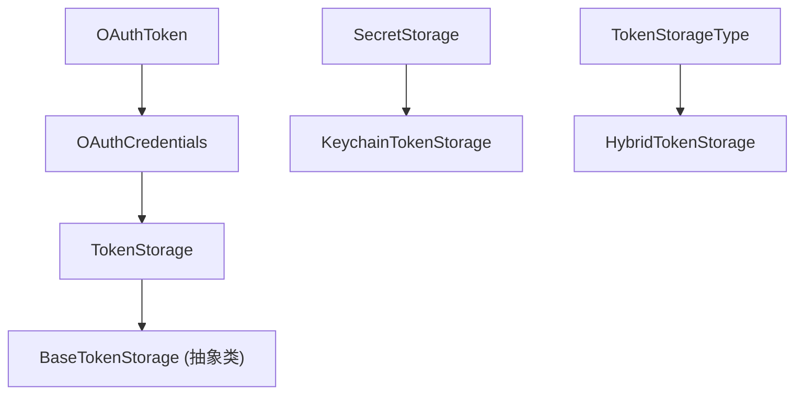

# types.ts

> token-storage 子模块的类型定义：令牌、凭据、存储接口和存储类型枚举

## 概述

本文件定义了令牌存储子系统的所有核心类型和接口，是该子模块的类型基础。它被 `base-token-storage.ts`、`keychain-token-storage.ts`、`hybrid-token-storage.ts` 以及上层的 `oauth-token-storage.ts` 和 `oauth-provider.ts` 广泛引用。

## 架构图



## 主要导出

### `OAuthToken` (接口)

```typescript
export interface OAuthToken {
  accessToken: string;       // 访问令牌
  refreshToken?: string;     // 刷新令牌（可选）
  expiresAt?: number;        // 过期时间戳（毫秒，可选）
  tokenType: string;         // 令牌类型（通常为 "Bearer"）
  scope?: string;            // 授权范围（可选）
}
```

OAuth 令牌的数据结构。`expiresAt` 为绝对毫秒时间戳。

### `OAuthCredentials` (接口)

```typescript
export interface OAuthCredentials {
  serverName: string;        // MCP 服务端名称标识
  token: OAuthToken;         // OAuth 令牌
  clientId?: string;         // OAuth 客户端 ID
  tokenUrl?: string;         // 令牌端点 URL
  mcpServerUrl?: string;     // MCP 服务端 URL
  updatedAt: number;         // 最后更新时间戳
}
```

存储的完整 OAuth 凭据，包含令牌及其关联的配置信息。

### `TokenStorage` (接口)

```typescript
export interface TokenStorage {
  getCredentials(serverName: string): Promise<OAuthCredentials | null>;
  setCredentials(credentials: OAuthCredentials): Promise<void>;
  deleteCredentials(serverName: string): Promise<void>;
  listServers(): Promise<string[]>;
  getAllCredentials(): Promise<Map<string, OAuthCredentials>>;
  clearAll(): Promise<void>;
}
```

令牌存储后端的统一接口，定义了 CRUD 操作和批量操作。

### `SecretStorage` (接口)

```typescript
export interface SecretStorage {
  setSecret(key: string, value: string): Promise<void>;
  getSecret(key: string): Promise<string | null>;
  deleteSecret(key: string): Promise<void>;
  listSecrets(): Promise<string[]>;
}
```

通用密钥-值存储接口，与 OAuth 凭据存储独立，由 `KeychainTokenStorage` 实现。

### `TokenStorageType` (枚举)

```typescript
export enum TokenStorageType {
  KEYCHAIN = 'keychain',
  ENCRYPTED_FILE = 'encrypted_file',
}
```

标识实际使用的存储后端类型，用于遥测和调试。

## 核心逻辑

本文件无运行时逻辑，仅为类型声明。

## 内部依赖

无。

## 外部依赖

无。
