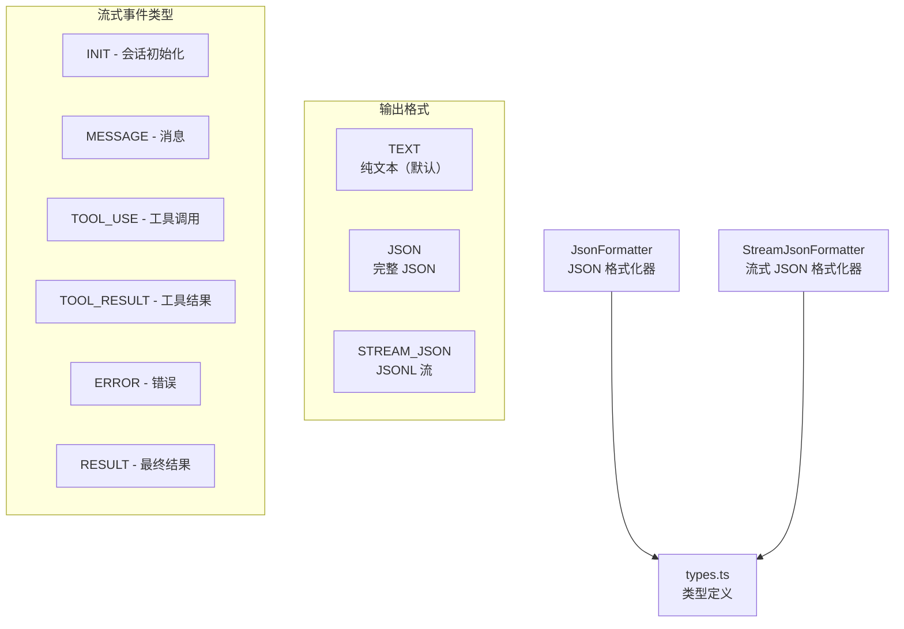

# output 架构

> 输出格式化模块，支持纯文本、JSON 和流式 JSON（JSONL）三种输出格式

## 概述

`output/` 模块为 Gemini CLI 提供多种输出格式支持。当 CLI 以非交互模式运行（如管道、脚本集成）时，可以选择 JSON 或流式 JSON 格式输出。JSON 格式在会话结束后一次性输出完整结果；流式 JSON（JSONL）格式实时输出事件流，每行一个 JSON 对象，适用于实时监控和工具集成场景。

## 架构图



## 目录结构

```
output/
├── types.ts                    # 输出格式枚举和事件类型定义
├── json-formatter.ts           # JsonFormatter：完整 JSON 格式化
└── stream-json-formatter.ts    # StreamJsonFormatter：流式 JSONL 格式化
```

## 关键文件

| 文件 | 功能 |
|------|------|
| `types.ts` | 定义 `OutputFormat` 枚举（TEXT/JSON/STREAM_JSON）、`JsonOutput` 接口（session_id、response、stats、error）、`JsonStreamEventType`（6 种事件：INIT/MESSAGE/TOOL_USE/TOOL_RESULT/ERROR/RESULT）、各事件的接口定义（InitEvent、MessageEvent 等）、`StreamStats`（Token 统计，含每模型分解） |
| `json-formatter.ts` | `JsonFormatter` 类：`format` 方法将 session_id、response、stats、error 组装为 `JsonOutput` 并序列化（使用 `strip-ansi` 清除 ANSI 转义码）；`formatError` 方法格式化错误输出 |
| `stream-json-formatter.ts` | `StreamJsonFormatter` 类：`formatEvent` 将事件序列化为单行 JSON + 换行符（JSONL 格式）；`emitEvent` 直接写入 stdout；`convertToStreamStats` 将 SessionMetrics 转换为 StreamStats（含每模型 Token 分解） |

## 内部依赖

- `telemetry/uiTelemetry.ts` - `SessionMetrics` 类型

## 外部依赖

| 依赖 | 用途 |
|------|------|
| `strip-ansi` | 清除 ANSI 转义码（确保 JSON 输出干净） |
