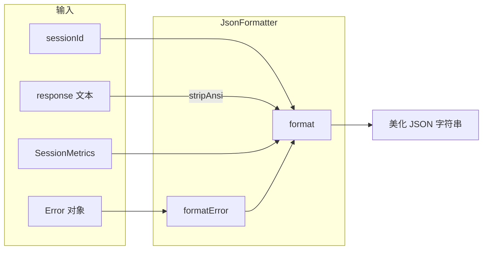

# json-formatter.ts

> 将会话响应和错误格式化为美化的 JSON 输出。

## 概述

`json-formatter.ts` 实现了 `JsonFormatter` 类，用于将 Gemini CLI 的会话结果（包括响应文本、会话指标、错误信息）格式化为结构化的 JSON 字符串。该格式化器在 `--output json` 模式下使用，产生一次性的完整 JSON 输出（与流式 JSONL 相对）。它还负责清除 ANSI 转义序列，确保 JSON 内容干净可解析。

## 架构图

## 主要导出

### 类 `JsonFormatter`

| 方法 | 签名 | 说明 |
|------|------|------|
| `format` | `(sessionId?, response?, stats?, error?) => string` | 将可选字段组装为 `JsonOutput` 并序列化为缩进 2 格的 JSON |
| `formatError` | `(error: Error, code?, sessionId?) => string` | 将 Error 对象转换为 `JsonError` 并调用 `format` |

## 核心逻辑

1. **ANSI 清理**：对 `response` 文本和错误消息使用 `stripAnsi` 清除终端颜色代码。
2. **可选字段**：所有字段均为可选，只有非空值才会出现在输出 JSON 中。
3. **错误格式化**：提取错误的构造函数名称作为 `type`，可选的 `code` 字段支持字符串和数字。

## 内部依赖

| 模块 | 导入项 | 用途 |
|------|--------|------|
| `../telemetry/uiTelemetry.js` | `SessionMetrics` (type) | 会话指标类型 |
| `./types.js` | `JsonError`, `JsonOutput` (types) | 输出类型定义 |

## 外部依赖

| 包名 | 用途 |
|------|------|
| `strip-ansi` | 移除 ANSI 转义序列 |
