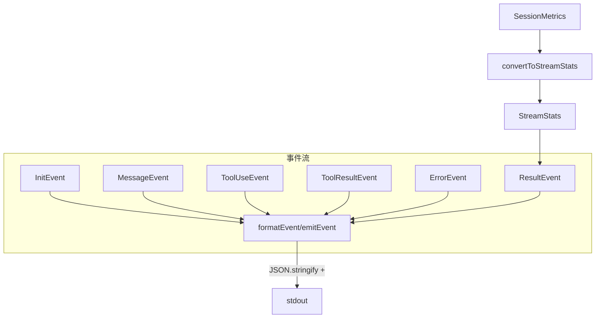

# stream-json-formatter.ts

> 流式 JSON 格式化器，以 JSONL（换行分隔 JSON）格式实时输出事件。

## 概述

`stream-json-formatter.ts` 实现了 `StreamJsonFormatter` 类，用于 `--output stream-json` 模式下的实时事件输出。与一次性 JSON 输出不同，流式格式化器将每个事件（初始化、消息、工具调用、工具结果、错误、最终结果）序列化为独立的 JSON 行（JSONL/Newline-Delimited JSON），直接写入 stdout。它还负责将 `SessionMetrics` 遥测数据转换为简化的 `StreamStats` 格式。

## 架构图

## 主要导出

### 类 `StreamJsonFormatter`

| 方法 | 签名 | 说明 |
|------|------|------|
| `formatEvent` | `(event: JsonStreamEvent) => string` | 将事件序列化为 JSON 字符串 + 换行符 |
| `emitEvent` | `(event: JsonStreamEvent) => void` | 将事件直接写入 `process.stdout` |
| `convertToStreamStats` | `(metrics: SessionMetrics, durationMs: number) => StreamStats` | 将遥测指标转换为流式统计格式 |

## 核心逻辑

1. **JSONL 格式**：每个事件被序列化为单行 JSON，以 `\n` 结尾，符合 JSONL 标准，便于流式解析。
2. **指标聚合**：`convertToStreamStats` 遍历所有模型的指标数据，按模型维度保留明细，同时计算汇总的 token 统计（total、input、output、cached）和工具调用次数。
3. **直接输出**：`emitEvent` 使用 `process.stdout.write` 而非 `console.log`，避免额外换行和格式化。

## 内部依赖

| 模块 | 导入项 | 用途 |
|------|--------|------|
| `./types.js` | `JsonStreamEvent`, `ModelStreamStats`, `StreamStats` (types) | 流式事件和统计类型 |
| `../telemetry/uiTelemetry.js` | `SessionMetrics` (type) | 会话指标类型 |

## 外部依赖

无。
