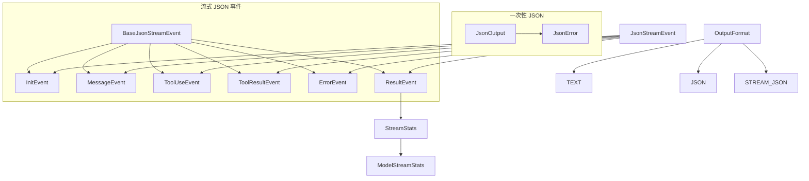

# types.ts (output)

> 定义输出模块的所有类型，包括输出格式枚举和流式 JSON 事件体系。

## 概述

`types.ts` 为输出模块提供完整的类型定义。它定义了三种输出格式（TEXT、JSON、STREAM_JSON）、一次性 JSON 输出结构、以及流式 JSON 的完整事件类型体系。流式事件类型覆盖了会话生命周期的所有阶段：初始化、消息交互、工具调用/结果、错误和最终结果。

## 架构图

## 主要导出

### 枚举

| 枚举 | 值 | 说明 |
|------|-----|------|
| `OutputFormat` | `TEXT`, `JSON`, `STREAM_JSON` | 输出格式选择 |
| `JsonStreamEventType` | `INIT`, `MESSAGE`, `TOOL_USE`, `TOOL_RESULT`, `ERROR`, `RESULT` | 流式事件类型 |

### 接口

| 接口 | 说明 |
|------|------|
| `JsonError` | 错误结构：type、message、可选 code |
| `JsonOutput` | 一次性 JSON 输出：session_id、response、stats、error |
| `BaseJsonStreamEvent` | 流式事件基础：type + timestamp |
| `InitEvent` | 会话初始化事件：session_id、model |
| `MessageEvent` | 消息事件：role(user/assistant)、content、delta 标志 |
| `ToolUseEvent` | 工具调用事件：tool_name、tool_id、parameters |
| `ToolResultEvent` | 工具结果事件：tool_id、status、output/error |
| `ErrorEvent` | 错误事件：severity(warning/error)、message |
| `ModelStreamStats` | 单模型 token 统计 |
| `StreamStats` | 汇总统计：token 总量、时长、工具调用数、按模型明细 |
| `ResultEvent` | 最终结果事件：status、可选 error 和 stats |

### 类型

| 类型 | 定义 | 说明 |
|------|------|------|
| `JsonStreamEvent` | 6 种事件的联合类型 | 所有流式事件的联合 |

## 核心逻辑

纯类型定义文件，无运行时逻辑。关键设计：

- **事件生命周期**：`INIT -> MESSAGE/TOOL_USE/TOOL_RESULT/ERROR -> RESULT`，完整覆盖会话各阶段。
- **Delta 模式**：`MessageEvent.delta` 标志支持增量文本输出。
- **Token 分层统计**：`ModelStreamStats` 区分 total、input、output、cached、input（未缓存），`StreamStats` 按模型维度聚合。

## 内部依赖

| 模块 | 导入项 | 用途 |
|------|--------|------|
| `../telemetry/uiTelemetry.js` | `SessionMetrics` (type) | 会话指标类型（用于 JsonOutput） |

## 外部依赖

无。
