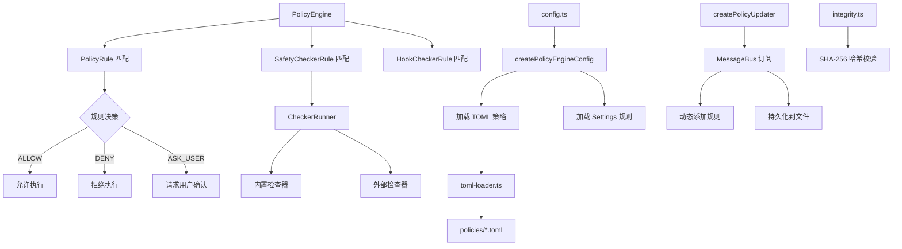

# policy 架构

> 基于规则优先级的工具调用策略引擎，控制工具执行的允许、拒绝和用户确认行为

## 概述

`policy` 模块是 Gemini CLI 的安全核心，负责决定每个工具调用是否应被允许（ALLOW）、拒绝（DENY）或需要用户确认（ASK_USER）。它通过多层策略规则体系（Default -> Extension -> Workspace -> User -> Admin）实现精细化的权限控制，支持 TOML 格式的策略文件定义、通配符匹配、Shell 命令拆分验证、MCP 工具命名空间匹配以及安全检查器集成。该模块是 `scheduler` 在执行工具前的必经检查点。

## 架构图



## 目录结构

```
policy/
├── index.ts                # 模块导出入口
├── policy-engine.ts        # 核心策略引擎实现
├── types.ts                # 类型定义（PolicyRule, ApprovalMode 等）
├── config.ts               # 策略配置加载与创建
├── toml-loader.ts          # TOML 策略文件解析器
├── integrity.ts            # 策略文件完整性校验
├── stable-stringify.ts     # 确定性 JSON 序列化（用于参数匹配）
├── utils.ts                # 正则构建与安全检查工具函数
└── policies/               # 默认策略定义目录
```

## 关键文件

| 文件 | 功能 |
|------|------|
| `policy-engine.ts` | `PolicyEngine` 类，核心策略匹配逻辑，支持规则优先级排序、通配符匹配、Shell 命令递归拆分检查、安全检查器执行 |
| `types.ts` | 定义 `PolicyDecision`（ALLOW/DENY/ASK_USER）、`ApprovalMode`（DEFAULT/AUTO_EDIT/YOLO/PLAN）、`PolicyRule`、`SafetyCheckerRule`、`HookCheckerRule` 等核心类型 |
| `config.ts` | `createPolicyEngineConfig` 从 TOML 文件和 Settings 构建策略引擎配置；`createPolicyUpdater` 通过 MessageBus 实现动态规则更新和持久化；定义五层优先级体系（DEFAULT=1, EXTENSION=2, WORKSPACE=3, USER=4, ADMIN=5） |
| `toml-loader.ts` | `loadPoliciesFromToml` 解析 TOML 文件为 PolicyRule 和 SafetyCheckerRule，使用 Zod schema 验证，支持 commandPrefix/commandRegex/argsPattern 转换，工具名称拼写检查 |
| `integrity.ts` | `PolicyIntegrityManager` 类，通过 SHA-256 哈希检测策略文件变更 |
| `stable-stringify.ts` | `stableStringify` 函数，生成键排序的确定性 JSON 字符串，用于策略参数的正则匹配，防止循环引用 |
| `utils.ts` | `buildArgsPatterns` 构建参数匹配正则，`isSafeRegExp` 防止 ReDoS 攻击，`escapeRegex` 正则转义 |

## 内部依赖

| 模块 | 用途 |
|------|------|
| `safety/checker-runner` | 执行安全检查器（内置和外部） |
| `safety/protocol` | 安全检查决策类型 |
| `utils/shell-utils` | Shell 命令解析和拆分 |
| `utils/debugLogger` | 调试日志 |
| `utils/events` | 事件总线（coreEvents.emitFeedback） |
| `utils/errors` | Node.js 错误类型判断 |
| `utils/security` | 目录安全性检查 |
| `utils/tool-utils` | 工具名称建议（拼写检查） |
| `tools/tool-names` | 工具名称常量和别名 |
| `tools/mcp-tool` | MCP 工具前缀和命名解析 |
| `config/storage` | 策略文件路径获取 |
| `confirmation-bus` | 消息总线用于动态策略更新 |

## 外部依赖

| 包 | 用途 |
|------|------|
| `@google/genai` | `FunctionCall` 类型 |
| `@iarna/toml` | TOML 文件解析和序列化 |
| `zod` | 策略文件 schema 验证 |
| `fast-levenshtein` | 工具名称拼写距离计算 |
