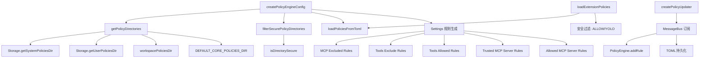

# config.ts

> 策略引擎配置中心：负责加载、组装和动态更新策略规则

## 概述

`config.ts` 是 policy 模块的配置枢纽，承担以下核心职责：

1. **策略目录发现**：根据优先级层级（Default -> Extension -> Workspace -> User -> Admin）确定策略文件搜索路径。
2. **策略配置组装**：从 TOML 文件和设置项中收集所有规则，构建 `PolicyEngineConfig` 对象。
3. **扩展策略加载**：安全地加载扩展贡献的策略，过滤掉不允许的 ALLOW 和 YOLO 模式规则。
4. **动态策略更新**：通过消息总线订阅策略变更事件，实现运行时规则添加与持久化。
5. **安全检查**：验证系统策略目录的安全性，防止不安全来源的策略被加载。

该文件是策略模块对外暴露的主要配置 API，被 `index.ts` 重导出。

## 架构图

## 主要导出

### 常量

| 常量名 | 值 | 说明 |
|--------|-----|------|
| `DEFAULT_CORE_POLICIES_DIR` | `__dirname/policies` | 核心默认策略目录路径 |
| `DEFAULT_POLICY_TIER` | 1 | 默认策略层级 |
| `EXTENSION_POLICY_TIER` | 2 | 扩展策略层级 |
| `WORKSPACE_POLICY_TIER` | 3 | 工作区策略层级 |
| `USER_POLICY_TIER` | 4 | 用户策略层级 |
| `ADMIN_POLICY_TIER` | 5 | 管理员策略层级（最高） |
| `MCP_EXCLUDED_PRIORITY` | 4.9 | MCP 排除规则优先级 |
| `EXCLUDE_TOOLS_FLAG_PRIORITY` | 4.4 | 工具排除标志优先级 |
| `ALLOWED_TOOLS_FLAG_PRIORITY` | 4.3 | 工具允许标志优先级 |
| `TRUSTED_MCP_SERVER_PRIORITY` | 4.2 | 受信任 MCP 服务器优先级 |
| `ALLOWED_MCP_SERVER_PRIORITY` | 4.1 | 允许的 MCP 服务器优先级 |
| `ALWAYS_ALLOW_PRIORITY` | 3.95 | "始终允许"规则优先级 |

### `clearEmittedPolicyWarnings(): void`

清除已发出的策略警告缓存，主要用于测试环境。

### `getPolicyDirectories(defaultPoliciesDir?, policyPaths?, workspacePoliciesDir?, adminPolicyPaths?): string[]`

按优先级从低到高返回策略文件搜索目录列表。优先级顺序：Default < Workspace < User < Admin。

### `getPolicyTier(dir, context): number`

根据目录路径确定其策略层级（1-5），供 TOML 加载器分配优先级段。

### `formatPolicyError(error: PolicyFileError): string`

将策略文件错误格式化为人类可读的控制台日志字符串。

### `loadExtensionPolicies(extensionName, policyDir): Promise<{rules, checkers, errors}>`

安全地加载扩展策略。安全限制：过滤掉 `ALLOW` 决策规则和 `YOLO` 模式规则，防止扩展自动批准工具调用。

### `createPolicyEngineConfig(settings, approvalMode, defaultPoliciesDir?): Promise<PolicyEngineConfig>`

核心函数。从 TOML 文件和设置项组装完整的 `PolicyEngineConfig`：
- 安全验证系统策略目录
- 加载 TOML 策略规则
- 从设置中生成 MCP 排除/允许规则、工具排除/允许规则、受信任 MCP 服务器规则
- 汇总所有错误并通过事件系统反馈

### `createPolicyUpdater(policyEngine, messageBus, storage): void`

创建策略更新器，订阅 `UPDATE_POLICY` 消息总线事件。收到事件后：
- 将命令前缀转换为参数模式
- 动态向 PolicyEngine 添加规则
- 可选地将规则持久化到 TOML 文件（通过原子写入保证安全性）

### `getAlwaysAllowPriorityFraction(): number`

返回"始终允许"优先级的小数部分（乘以 1000 后取整），用于持久化一致性。

## 核心逻辑

### 优先级系统

采用"层级 + 小数优先级"的混合设计：`实际优先级 = 层级 + TOML优先级/1000`。例如：
- 默认层级优先级 100 -> 1.100
- 用户层级优先级 100 -> 4.100

这确保 Admin > User > Workspace > Extension > Default 的层级关系始终被保持。

### 安全机制

1. **系统策略目录安全检查**：通过 `isDirectorySecure` 验证系统策略目录的安全性
2. **扩展策略过滤**：禁止扩展贡献 ALLOW 和 YOLO 模式规则
3. **管理员策略互斥**：如果系统目录已有 TOML 文件，忽略 `--admin-policy` 标志
4. **正则表达式安全验证**：通过 `isSafeRegExp` 防止 ReDoS 攻击
5. **原子文件写入**：持久化时使用唯一临时文件 + rename 避免竞态条件
6. **序列化持久化队列**：使用 Promise 链确保并发事件不会导致更新丢失

## 内部依赖

| 模块 | 用途 |
|------|------|
| `./types.js` | 类型定义（ApprovalMode, PolicyDecision 等） |
| `./policy-engine.js` | PolicyEngine 类型引用 |
| `./toml-loader.js` | TOML 策略加载 |
| `./utils.js` | buildArgsPatterns, isSafeRegExp |
| `../config/storage.js` | 存储路径管理 |
| `../confirmation-bus/types.js` | 消息总线类型 |
| `../confirmation-bus/message-bus.js` | 消息总线 |
| `../utils/events.js` | 核心事件系统 |
| `../utils/debugLogger.js` | 调试日志 |
| `../utils/shell-utils.js` | Shell 工具名称 |
| `../tools/tool-names.js` | 工具名称常量和敏感工具集 |
| `../tools/mcp-tool.js` | MCP 工具前缀 |
| `../utils/errors.js` | Node 错误类型检查 |
| `../utils/security.js` | 目录安全检查 |

## 外部依赖

| 包 | 用途 |
|----|------|
| `node:fs/promises` | 文件系统异步操作 |
| `node:path` | 路径处理 |
| `node:crypto` | 生成唯一临时文件后缀 |
| `node:url` | `fileURLToPath` 用于 ESM `__dirname` 模拟 |
| `@iarna/toml` | TOML 序列化 |
