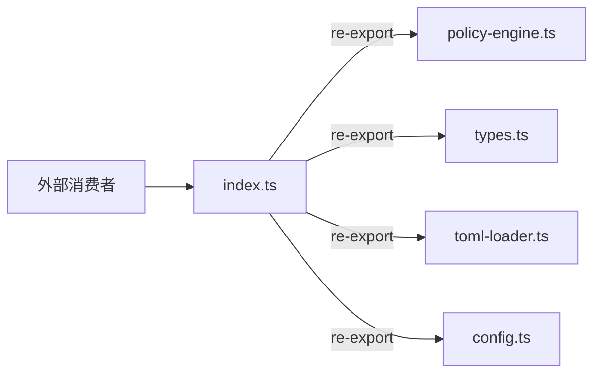

# index.ts

> policy 模块的统一入口，重导出所有公开 API

## 概述

`index.ts` 是 policy 模块的桶文件（barrel file），将模块内各子文件的公开导出统一集中到一个入口点。其他模块只需 `import { ... } from './policy/index.js'` 即可访问策略引擎的全部公开 API，无需了解内部文件组织结构。

该文件不包含任何业务逻辑，仅承担模块聚合的角色。

## 架构图

## 主要导出

通过 `export *` 重导出以下模块的全部公开成员：

| 来源模块 | 主要导出内容 |
|----------|-------------|
| `policy-engine.ts` | `PolicyEngine` 类 |
| `types.ts` | `PolicyDecision`, `ApprovalMode`, `PolicyRule`, `PolicyEngineConfig` 等类型 |
| `toml-loader.ts` | `loadPoliciesFromToml`, `readPolicyFiles`, `validateMcpPolicyToolNames` 等 |
| `config.ts` | `createPolicyEngineConfig`, `createPolicyUpdater`, `loadExtensionPolicies` 等 |

## 核心逻辑

无业务逻辑，仅使用 `export *` 语法进行模块聚合。

## 内部依赖

| 模块 | 用途 |
|------|------|
| `./policy-engine.js` | 策略引擎核心实现 |
| `./types.js` | 策略类型定义 |
| `./toml-loader.js` | TOML 策略文件加载器 |
| `./config.js` | 策略配置与更新 |

## 外部依赖

无直接外部依赖。
