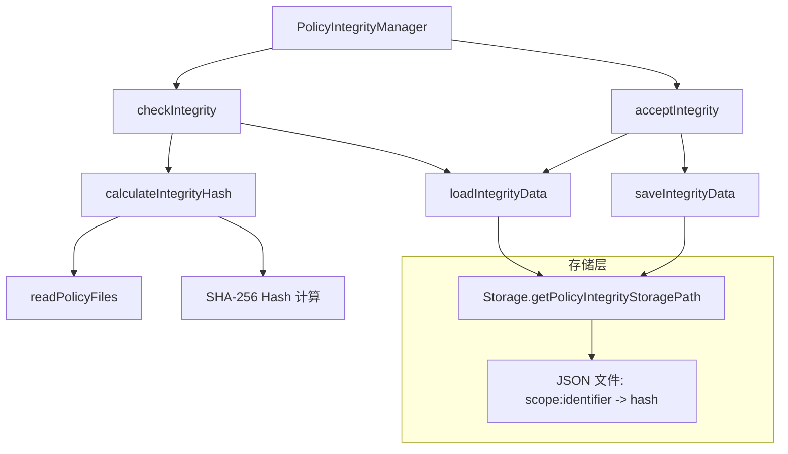

# integrity.ts

> 策略文件完整性校验管理器，检测策略文件是否被篡改或变更

## 概述

`integrity.ts` 实现了策略文件的完整性验证机制。通过计算策略目录中所有文件的 SHA-256 哈希值，并与之前存储的哈希值对比，来检测策略文件是否被新增、修改或删除。

该文件的设计动机是提供一种安全机制，当工作区策略文件发生变化时，系统可以提示用户审查变更，防止恶意或意外的策略篡改。

## 架构图



## 主要导出

### `enum IntegrityStatus`

| 值 | 说明 |
|----|------|
| `MATCH` | 当前哈希与存储的哈希一致 |
| `MISMATCH` | 当前哈希与存储的哈希不一致，策略文件已变更 |
| `NEW` | 该作用域/标识符下无存储的哈希，首次检查 |

### `interface IntegrityResult`

```typescript
{
  status: IntegrityStatus;  // 检查结果状态
  hash: string;             // 当前计算的哈希值
  fileCount: number;        // 参与哈希计算的文件数量
}
```

### `class PolicyIntegrityManager`

策略完整性管理器，提供以下公开方法：

#### `checkIntegrity(scope, identifier, policyDir): Promise<IntegrityResult>`

检查给定目录下策略文件的完整性。
- `scope`: 策略作用域（如 'project', 'user'）
- `identifier`: 作用域的唯一标识（如项目路径）
- `policyDir`: 策略文件所在目录

#### `acceptIntegrity(scope, identifier, hash): Promise<void>`

接受并持久化当前完整性哈希，标记当前策略状态为"已审查"。

## 核心逻辑

### 哈希计算

1. 从策略目录读取所有 `.toml` 文件
2. 按文件路径字母序排序（确保确定性）
3. 对每个文件，将 `相对路径 + \0 + 文件内容 + \0` 写入 SHA-256 哈希流
4. 返回十六进制哈希摘要

包含文件路径是为了检测文件重命名操作。

### 存储格式

完整性数据存储为 JSON 文件，键为 `scope:identifier`，值为哈希字符串。

## 内部依赖

| 模块 | 用途 |
|------|------|
| `../config/storage.js` | 获取完整性数据存储路径 |
| `./toml-loader.js` | `readPolicyFiles` 读取策略文件 |
| `../utils/debugLogger.js` | 调试日志 |
| `../utils/errors.js` | Node 错误类型检查 |

## 外部依赖

| 包 | 用途 |
|----|------|
| `node:crypto` | SHA-256 哈希计算 |
| `node:fs/promises` | 异步文件读写 |
| `node:path` | 路径处理 |
