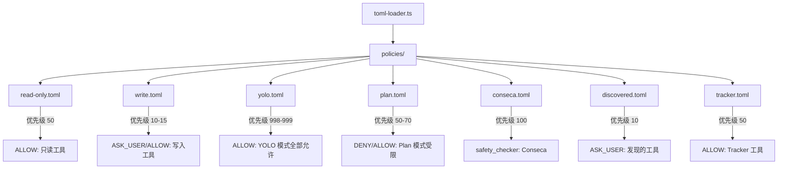

# policies 架构

> 默认策略定义目录，通过 TOML 文件定义各审批模式下的工具访问规则

## 概述

`policies` 目录包含 Gemini CLI 的默认策略定义文件（Default 层级，优先级最低）。这些 TOML 文件定义了不同审批模式（Default、Auto-Edit、YOLO、Plan）下各类工具的默认访问权限。策略引擎在启动时加载这些文件，并将其作为基准规则层。用户和管理员可以通过更高层级的策略来覆盖这些默认规则。

## 架构图



## 目录结构

```
policies/
├── read-only.toml     # 只读工具默认允许规则
├── write.toml         # 写入工具默认需确认规则
├── yolo.toml          # YOLO 模式全部允许规则
├── plan.toml          # Plan 模式限制规则
├── conseca.toml       # Conseca 安全检查器规则
├── discovered.toml    # 动态发现工具默认规则
└── tracker.toml       # 任务跟踪器工具允许规则
```

## 关键文件

| 文件 | 功能 |
|------|------|
| `read-only.toml` | 定义只读工具（glob、grep_search、list_directory、read_file、google_web_search、codebase_investigator、cli_help）在优先级 50 为 ALLOW |
| `write.toml` | 定义写入工具（replace、run_shell_command、write_file、activate_skill、save_memory、web_fetch）在优先级 10 为 ASK_USER；Auto-Edit 模式下 replace 和 write_file 在优先级 15 升级为 ALLOW 并附带 allowed-path 安全检查器 |
| `yolo.toml` | YOLO 模式下：ask_user 保持 ASK_USER（优先级 999）、plan 模式工具被 DENY、其他工具全部 ALLOW（优先级 998）并允许重定向 |
| `plan.toml` | Plan 模式下：全局 DENY（优先级 60），只读工具和 plan 相关工具显式 ALLOW（优先级 70），write_file/replace 仅限 plans 目录的 .md 文件 |
| `conseca.toml` | 注册 Conseca 内容安全检查器，作用于所有工具（toolName = "*"），优先级 100 |
| `discovered.toml` | 通过 toolDiscoveryCommand 发现的工具默认为 ASK_USER（优先级 10） |
| `tracker.toml` | 任务跟踪器相关工具（tracker_create_task、tracker_update_task 等）默认 ALLOW（优先级 50） |

## 内部依赖

这些 TOML 文件不直接依赖代码模块，而是被 `policy/toml-loader.ts` 加载解析。

## 外部依赖

无。这些是纯配置文件。
