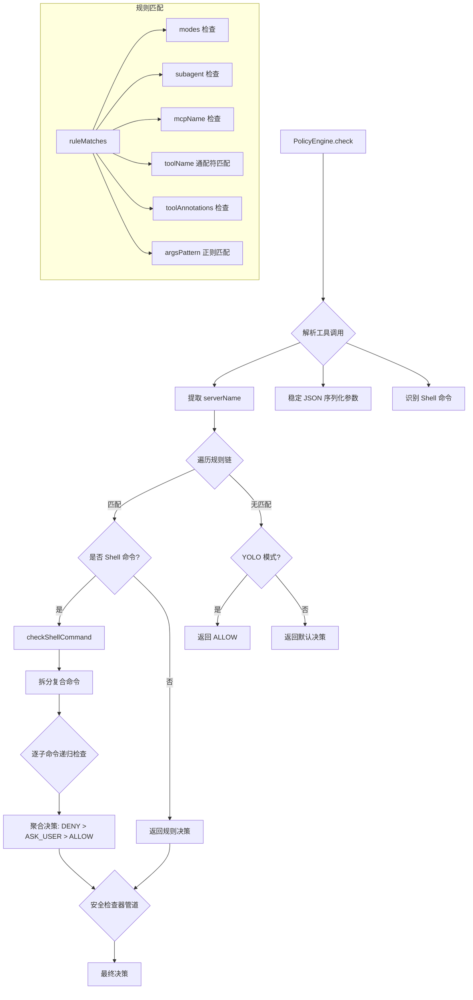

# policy-engine.ts

> 策略引擎核心实现：基于优先级规则链对工具调用进行访问控制决策

## 概述

`policy-engine.ts` 是整个策略系统的核心运行时组件。它接收一组按优先级排序的规则和安全检查器，对每次工具调用执行匹配和决策。

设计特点：
- **优先级驱动**：规则按优先级从高到低排序，首个匹配的规则决定结果
- **Shell 命令拆分**：对 Shell 工具的复合命令（管道、链式等）拆分为子命令，逐一检查
- **安全检查器管道**：在规则匹配后，还会执行配置的安全检查器（如路径检查、命令安全性检查）
- **批准模式感知**：规则可限定在特定批准模式（DEFAULT / AUTO_EDIT / YOLO / PLAN）下生效
- **MCP 工具支持**：通过通配符模式和服务器名称元数据精确匹配 MCP 工具

## 架构图



## 主要导出

### `class PolicyEngine`

策略引擎主类。

#### 构造函数

```typescript
constructor(config?: PolicyEngineConfig, checkerRunner?: CheckerRunner)
```

接受配置对象和可选的检查器运行器。规则和检查器在构造时按优先级降序排列。

#### `check(toolCall, serverName, toolAnnotations?, subagent?): Promise<CheckResult>`

核心方法。对工具调用执行策略检查，返回 `{ decision, rule? }`。

决策流程：
1. 确定 MCP 服务器名称（元数据注入 -> FQN 解析 -> 回退）
2. 对参数进行稳定 JSON 序列化
3. 遍历规则链，支持工具别名匹配
4. Shell 命令特殊处理（拆分、递归检查、重定向降级）
5. 执行安全检查器管道
6. 非交互模式下 ASK_USER 降级为 DENY

#### `addRule(rule: PolicyRule): void`

动态添加规则并重新排序。

#### `addChecker(checker: SafetyCheckerRule): void`

动态添加安全检查器。

#### `removeRulesByTier(tier: number): void`

按层级移除规则。

#### `removeRulesBySource(source: string): void`

按来源移除规则。

#### `removeRulesForTool(toolName, source?): void`

移除指定工具的规则。

#### `getRules(): readonly PolicyRule[]`

获取所有当前规则（只读）。

#### `hasRuleForTool(toolName, ignoreDynamic?): boolean`

检查是否存在特定工具的规则。

#### `setApprovalMode(mode: ApprovalMode): void` / `getApprovalMode(): ApprovalMode`

设置/获取当前批准模式。

#### `getExcludedTools(toolMetadata?, allToolNames?): Set<string>`

返回被策略静态排除的工具集合，用于从工具列表中移除不可用工具。

#### `addHookChecker(checker: HookCheckerRule): void` / `getHookCheckers(): readonly HookCheckerRule[]`

管理 Hook 安全检查器。

## 核心逻辑

### 规则匹配 (`ruleMatches`)

按以下顺序依次检查：
1. **批准模式过滤**：规则指定了 `modes` 时，当前模式必须在列表中
2. **子代理匹配**：规则指定了 `subagent` 时必须完全匹配
3. **MCP 服务器匹配**：通过 `mcpName` 精确匹配或 `*` 通配
4. **工具名称匹配**：支持 `*`（全局通配）、`mcp_serverName_*`（MCP 服务器通配）、精确匹配
5. **工具注解匹配**：规则的 `toolAnnotations` 中所有键值对必须在工具元数据中存在
6. **参数模式匹配**：使用 `stableStringify` 序列化后的参数与 `argsPattern` 正则匹配

### Shell 命令处理

- 使用 tree-sitter 解析器拆分复合 Shell 命令
- 对每个子命令递归调用 `check`
- 聚合规则：任一子命令 DENY -> 整体 DENY；任一 ASK_USER -> 整体 ASK_USER
- 重定向检测：非 YOLO/AUTO_EDIT 模式下，含重定向的命令从 ALLOW 降级为 ASK_USER

### 非交互模式

当 `nonInteractive` 为 true 时，所有 `ASK_USER` 决策自动降级为 `DENY`。

## 内部依赖

| 模块 | 用途 |
|------|------|
| `./types.js` | 策略类型定义 |
| `./stable-stringify.js` | 确定性 JSON 序列化 |
| `../utils/debugLogger.js` | 调试日志 |
| `../safety/checker-runner.js` | 安全检查器运行器 |
| `../safety/protocol.js` | 安全检查决策类型 |
| `../utils/shell-utils.js` | Shell 命令解析与拆分 |
| `../tools/tool-names.js` | 工具别名解析 |
| `../tools/mcp-tool.js` | MCP 工具名称解析与前缀 |

## 外部依赖

| 包 | 用途 |
|----|------|
| `@google/genai` | `FunctionCall` 类型 |
