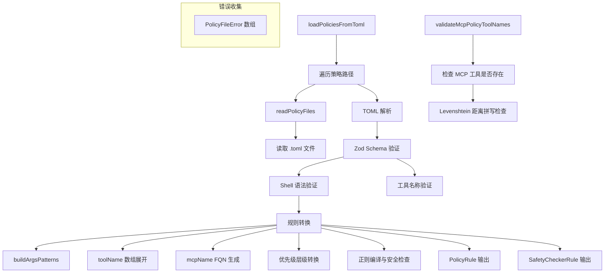

# toml-loader.ts

> TOML 策略文件的加载、验证与转换器

## 概述

`toml-loader.ts` 是策略文件的 I/O 与解析层，负责：

1. 从指定目录或单个文件中发现和读取 `.toml` 策略文件
2. 使用 Zod schema 进行严格的结构验证
3. 将 TOML 格式的原始规则转换为内部 `PolicyRule` 和 `SafetyCheckerRule` 对象
4. 处理 Shell 命令便捷语法（`commandPrefix`、`commandRegex`）
5. 验证工具名称的有效性，检测疑似拼写错误
6. 收集所有解析错误并以结构化方式返回
7. 在 MCP 服务器连接后验证策略中引用的工具名称

## 架构图

## 主要导出

### 类型

#### `PolicyFileErrorType`

错误类型枚举：`'file_read' | 'toml_parse' | 'schema_validation' | 'rule_validation' | 'regex_compilation' | 'tool_name_warning'`

#### `PolicyFileError`

结构化错误信息，包含文件路径、文件名、层级、规则索引、错误类型、消息、详情、建议和严重级别。

#### `PolicyLoadResult`

加载结果：`{ rules: PolicyRule[], checkers: SafetyCheckerRule[], errors: PolicyFileError[] }`

#### `PolicyFile`

策略文件：`{ path: string, content: string }`

### 函数

#### `readPolicyFiles(policyPath: string): Promise<PolicyFile[]>`

从目录（读取所有 `.toml` 文件）或单个 `.toml` 文件读取策略内容。目录不存在时返回空数组。

#### `loadPoliciesFromToml(policyPaths, getPolicyTier): Promise<PolicyLoadResult>`

核心加载函数。处理步骤：
1. 遍历所有路径，调用 `readPolicyFiles` 读取文件
2. 使用 `@iarna/toml` 解析 TOML 语法
3. 使用 Zod `PolicyFileSchema` 验证结构
4. 验证 Shell 命令便捷语法的互斥约束
5. 验证工具名称（Levenshtein 拼写检查）
6. 转换规则：展开 toolName 数组、构建 argsPattern、注入 mcpName FQN、层级优先级转换
7. 编译正则并进行 ReDoS 安全检查
8. 返回规则、检查器和所有收集的错误

#### `validateMcpPolicyToolNames(serverName, discoveredToolNames, policyRules): string[]`

在 MCP 服务器工具发现后调用。检查策略规则中引用的 MCP 工具名称是否存在于实际发现的工具列表中，使用 Levenshtein 距离(阈值为3)检测疑似拼写错误。

## 核心逻辑

### Schema 验证

使用 Zod 定义了三层 schema：
- `PolicyRuleSchema`：单条规则，包含 toolName、decision、priority(0-999)、modes、argsPattern、commandPrefix/commandRegex 等
- `SafetyCheckerRuleSchema`：安全检查器规则，含 checker 字段（区分 in-process/external）
- `PolicyFileSchema`：文件级 schema，含 `rule[]` 和 `safety_checker[]`

### 优先级转换

`transformPriority(priority, tier) = tier + priority/1000`

确保 priority 在 [0, 999] 范围内，防止层级溢出。

### Shell 命令便捷语法

- `commandPrefix`：转换为匹配 `"command":"<prefix>` 开头的正则
- `commandRegex`：直接嵌入 `"command":"` 后作为正则
- 两者与 `argsPattern` 互斥，且不能同时使用

### 工具名称验证

- 先检查是否为已知的内置工具名
- 对未知名称使用 Levenshtein 距离与所有内置工具名比较
- 距离 <= 3 时视为拼写错误并发出警告
- 距离 > 3 时认为是有意的自定义名称（如动态工具）

## 内部依赖

| 模块 | 用途 |
|------|------|
| `./types.js` | PolicyRule, PolicyDecision, ApprovalMode 等类型 |
| `./utils.js` | buildArgsPatterns, isSafeRegExp |
| `../tools/tool-names.js` | isValidToolName, ALL_BUILTIN_TOOL_NAMES |
| `../tools/mcp-tool.js` | MCP_TOOL_PREFIX, formatMcpToolName |
| `../utils/tool-utils.js` | getToolSuggestion |
| `../utils/errors.js` | isNodeError |

## 外部依赖

| 包 | 用途 |
|----|------|
| `@iarna/toml` | TOML 文件解析 |
| `zod` | 运行时 schema 验证 |
| `fast-levenshtein` | 编辑距离计算（拼写检查） |
| `node:fs/promises` | 异步文件读取 |
| `node:path` | 路径处理 |
