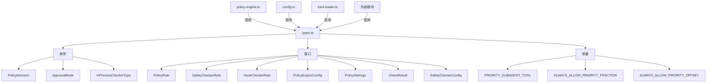

# types.ts

> 策略模块的核心类型定义：枚举、接口和常量

## 概述

`types.ts` 集中定义了策略模块所需的所有类型、枚举和常量。作为模块的类型基础设施，它被策略模块内的几乎所有文件依赖，同时也通过 `index.ts` 导出供外部模块使用。

该文件的设计遵循"类型与实现分离"的原则，确保类型定义不引入运行时依赖，保持模块间的低耦合。

## 架构图

## 主要导出

### 枚举

#### `PolicyDecision`

策略决策结果：

| 值 | 说明 |
|----|------|
| `ALLOW` | 允许工具调用 |
| `DENY` | 拒绝工具调用 |
| `ASK_USER` | 需要用户确认 |

#### `ApprovalMode`

批准模式：

| 值 | 说明 |
|----|------|
| `DEFAULT` | 默认模式，需要用户确认 |
| `AUTO_EDIT` | 自动编辑模式 |
| `YOLO` | 全自动模式，最少干预 |
| `PLAN` | 计划模式，只读探索 |

#### `InProcessCheckerType`

内置安全检查器类型：

| 值 | 说明 |
|----|------|
| `ALLOWED_PATH` | 路径允许列表检查 |
| `CONSECA` | CONSECA 安全检查 |

### 类型

#### `HookSource`

钩子执行来源：`'project' | 'user' | 'system' | 'extension'`

#### `SafetyCheckerConfig`

安全检查器配置的区分联合类型：`ExternalCheckerConfig | InProcessCheckerConfig`

### 接口

#### `PolicyRule`

策略规则定义，核心字段：
- `toolName?`: 匹配的工具名称（支持通配符）
- `subagent?`: 匹配的子代理名称
- `mcpName?`: 匹配的 MCP 服务器名称
- `argsPattern?`: 参数匹配正则
- `toolAnnotations?`: 工具注解匹配
- `decision`: 决策结果（ALLOW / DENY / ASK_USER）
- `priority?`: 优先级（高值优先）
- `modes?`: 适用的批准模式列表
- `allowRedirection?`: 是否允许重定向
- `source?`: 规则来源标识
- `denyMessage?`: DENY 时的显示消息

#### `SafetyCheckerRule`

安全检查器规则，定义何时以及如何运行安全检查。包含与 PolicyRule 类似的匹配字段，加上 `checker: SafetyCheckerConfig`。

#### `HookCheckerRule`

钩子安全检查器规则，用于钩子执行的安全验证。

#### `PolicyEngineConfig`

策略引擎配置：
- `rules?`: 策略规则列表
- `checkers?`: 安全检查器列表
- `hookCheckers?`: 钩子检查器列表
- `defaultDecision?`: 无规则匹配时的默认决策
- `nonInteractive?`: 非交互模式标志
- `disableAlwaysAllow?`: 禁用"始终允许"规则
- `allowHooks?`: 是否允许钩子执行
- `approvalMode?`: 当前批准模式

#### `PolicySettings`

策略设置，来自用户配置：
- `mcp?`: MCP 排除/允许列表
- `tools?`: 工具排除/允许列表
- `mcpServers?`: MCP 服务器信任配置
- `policyPaths?` / `adminPolicyPaths?`: 自定义策略路径
- `workspacePoliciesDir?`: 工作区策略目录
- `disableAlwaysAllow?`: 禁用始终允许

#### `CheckResult`

检查结果：`{ decision: PolicyDecision, rule?: PolicyRule }`

### 常量

| 常量 | 值 | 说明 |
|------|-----|------|
| `PRIORITY_SUBAGENT_TOOL` | 1.05 | 子代理工具动态注册的优先级 |
| `ALWAYS_ALLOW_PRIORITY_FRACTION` | 950 | "始终允许"规则的小数优先级部分 |
| `ALWAYS_ALLOW_PRIORITY_OFFSET` | 0.95 | "始终允许"规则的优先级偏移量 |

### 函数

#### `getHookSource(input: Record<string, unknown>): HookSource`

从输入记录中安全提取并验证钩子来源，无效时默认返回 `'project'`。

## 核心逻辑

该文件为纯类型定义文件，唯一的运行时逻辑是 `getHookSource` 的安全验证。

## 内部依赖

| 模块 | 用途 |
|------|------|
| `../safety/protocol.js` | `SafetyCheckInput` 类型引用 |

## 外部依赖

无外部依赖。
