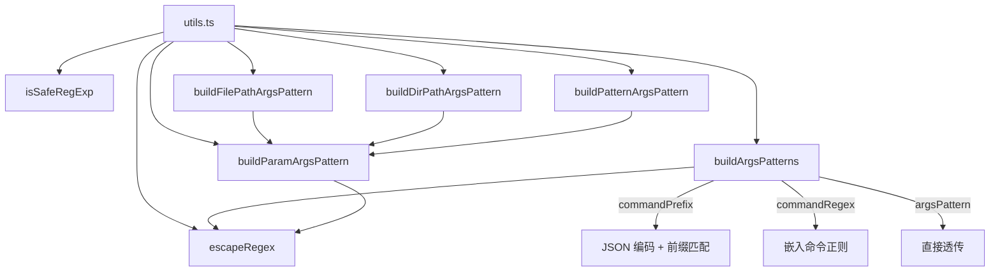

# utils.ts

> 策略模块的工具函数集：正则转义、安全性检查和参数模式构建

## 概述

`utils.ts` 提供了策略模块所需的底层工具函数，主要围绕正则表达式处理和参数模式构建。这些函数是策略规则匹配机制的基础设施，被 `toml-loader.ts` 和 `config.ts` 广泛使用。

核心职责：
1. 正则表达式特殊字符转义
2. ReDoS（正则表达式拒绝服务）安全性启发式检查
3. 将 Shell 命令前缀/正则转换为策略引擎内部使用的 `argsPattern` 格式
4. 构建针对特定工具参数的精确匹配模式

## 架构图

## 主要导出

### `escapeRegex(text: string): string`

将字符串中所有正则表达式特殊字符进行转义，使其在正则中作为字面量匹配。转义字符包括 `-[]{}()*+?.,\^$|#\s"`。

### `isSafeRegExp(pattern: string): boolean`

启发式检查正则表达式的安全性，防止 ReDoS 攻击。检查项：
1. 是否为有效正则语法
2. 长度不超过 2048 字符
3. 不含嵌套量词模式（如 `(a+)+`、`(.*)*`）

### `buildArgsPatterns(argsPattern?, commandPrefix?, commandRegex?): Array<string | undefined>`

将多种输入格式转换为策略引擎的内部 `argsPattern` 正则字符串：

| 输入 | 转换逻辑 |
|------|---------|
| `commandPrefix` | JSON 编码前缀，构建匹配 `"command":"<prefix>` 后跟空白/引号的正则 |
| `commandRegex` | 直接嵌入 `"command":"` 后的正则字符串 |
| `argsPattern` | 原样透传 |

`commandPrefix` 支持字符串或字符串数组，数组时每个前缀产生一个独立的模式。

### `buildParamArgsPattern(paramName: string, value: unknown): string`

构建匹配 `stableStringify` 输出中顶层 JSON 属性的精确正则模式。使用 `\\0` 边界标记防止参数注入攻击。

### `buildFilePathArgsPattern(filePath: string): string`

`buildParamArgsPattern('file_path', filePath)` 的便捷包装。

### `buildDirPathArgsPattern(dirPath: string): string`

`buildParamArgsPattern('dir_path', dirPath)` 的便捷包装。

### `buildPatternArgsPattern(pattern: string): string`

`buildParamArgsPattern('pattern', pattern)` 的便捷包装。

## 核心逻辑

### commandPrefix 转换细节

转换过程：
1. 使用 `JSON.stringify(prefix)` 安全编码前缀（处理引号、换行等特殊字符）
2. 去掉尾部的 `"` 使其成为开放前缀
3. 对编码结果进行 `escapeRegex` 转义
4. 追加 `(?:[\s"]|\\\\")` 后缀，允许前缀后跟空白、引号或转义引号

例如，前缀 `git commit` 会转换为匹配 `"command":"git commit ` 或 `"command":"git commit"` 的正则。

### 参数注入防护

`buildParamArgsPattern` 使用 `\\0` 标记来匹配 `stableStringify` 输出中的顶层属性边界。这确保正则只匹配顶层参数，而不会被嵌套对象中的同名属性欺骗。

## 内部依赖

无内部依赖（纯工具函数文件）。

## 外部依赖

无外部依赖。
