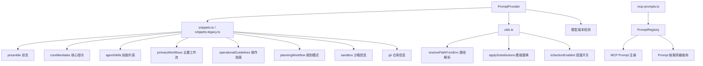

# prompts 架构

> 系统提示词的组装与生成引擎，负责构建发送给 LLM 的核心系统指令

## 概述

`prompts` 模块负责生成 Gemini CLI 的系统提示词（System Prompt）。它通过 `PromptProvider` 编排各个提示片段（snippets），根据当前的审批模式、工具集、技能集、模型版本等上下文信息动态组合系统提示。模块还管理 MCP 服务器提供的提示词以及 `PromptRegistry` 提示注册表。该模块支持两套 snippet 系统：现代模型使用 `snippets.ts`，遗留模型使用 `snippets.legacy.ts`。

## 架构图



## 目录结构

```
prompts/
├── promptProvider.ts      # 提示词提供者，编排系统提示生成
├── prompt-registry.ts     # MCP 提示词注册表
├── snippets.ts            # 现代模型的提示片段模板
├── snippets.legacy.ts     # 遗留模型的提示片段模板
├── mcp-prompts.ts         # MCP 服务器提示词查询工具
└── utils.ts               # 提示工具函数（路径解析、模板替换）
```

## 关键文件

| 文件 | 功能 |
|------|------|
| `promptProvider.ts` | `PromptProvider` 类，`getCoreSystemPrompt` 方法根据 AgentLoopContext 组装完整系统提示，支持自定义 system.md 文件覆盖，自动选择现代/遗留 snippet，处理 Plan/YOLO/AutoEdit 等模式的差异化提示 |
| `prompt-registry.ts` | `PromptRegistry` 类，管理 MCP 服务器发现的提示词定义，支持按名称/服务器查询，处理名称冲突自动重命名 |
| `snippets.ts` | 定义 `SystemPromptOptions` 接口和各提示段落的渲染函数（renderAgentSkills, renderSubAgents 等），为 Gemini 3+ 模型提供优化的提示模板 |
| `snippets.legacy.ts` | 为旧版模型提供兼容的提示模板，包含更详细的 finalReminder 段落 |
| `mcp-prompts.ts` | `getMCPServerPrompts` 函数，从 PromptRegistry 获取指定 MCP 服务器的提示词 |
| `utils.ts` | `resolvePathFromEnv` 解析环境变量路径，`applySubstitutions` 处理模板变量替换（${AgentSkills}、${SubAgents} 等），`isSectionEnabled` 通过 GEMINI_PROMPT_* 环境变量控制段落开关 |

## 内部依赖

| 模块 | 用途 |
|------|------|
| `config/config` | Config 配置接口 |
| `config/memory` | HierarchicalMemory 类型 |
| `config/models` | resolveModel, supportsModernFeatures 模型解析 |
| `config/agent-loop-context` | AgentLoopContext 上下文类型 |
| `policy/types` | ApprovalMode 审批模式 |
| `tools/tool-names` | 工具名称常量 |
| `tools/mcp-tool` | DiscoveredMCPTool MCP 工具类型 |
| `tools/mcp-client` | DiscoveredMCPPrompt 类型 |
| `tools/memoryTool` | getAllGeminiMdFilenames, DEFAULT_CONTEXT_FILENAME |
| `agents/codebase-investigator` | CodebaseInvestigatorAgent 代码库调查代理 |
| `utils/paths` | GEMINI_DIR, homedir |
| `utils/gitUtils` | isGitRepository Git 仓库检测 |

## 外部依赖

| 包 | 用途 |
|------|------|
| `node:fs` | 文件系统操作（读取 system.md） |
| `node:path` | 路径处理 |
| `node:process` | 环境变量读取 |
