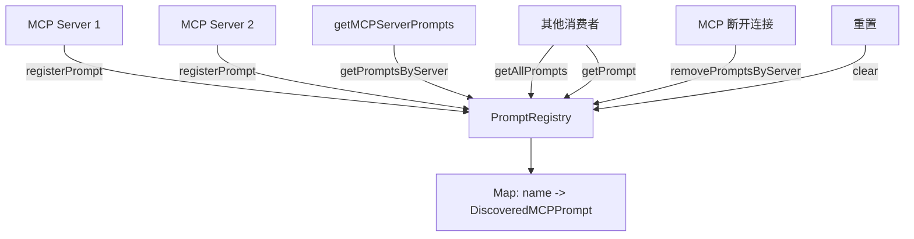

# prompt-registry.ts

> 提示词注册表：集中管理 MCP 服务器发现的提示词定义

## 概述

`prompt-registry.ts` 实现了 `PromptRegistry` 类，作为所有 MCP 提示词的集中存储和管理器。当 MCP 服务器连接后发现的提示词被注册到此注册表中，供系统其他部分查询和使用。

设计要点：
- 名称唯一性保证：重复名称自动添加服务器名称前缀
- 按服务器分组查询能力
- 完整的生命周期管理（注册、查询、清除、按服务器移除）

## 架构图

## 主要导出

### `class PromptRegistry`

提示词注册表类。

#### `registerPrompt(prompt: DiscoveredMCPPrompt): void`

注册一个提示词定义。如果名称已存在，自动重命名为 `${serverName}_${name}` 并记录警告。

#### `getAllPrompts(): DiscoveredMCPPrompt[]`

返回所有已注册的提示词实例，按名称字母序排列。

#### `getPrompt(name: string): DiscoveredMCPPrompt | undefined`

根据名称获取特定提示词定义。

#### `getPromptsByServer(serverName: string): DiscoveredMCPPrompt[]`

返回指定 MCP 服务器注册的所有提示词，按名称排序。

#### `removePromptsByServer(serverName: string): void`

移除指定服务器的所有提示词。通常在 MCP 服务器断开连接时调用。

#### `clear(): void`

清空所有注册的提示词。

## 核心逻辑

### 名称冲突处理

当注册同名提示词时，使用 `${serverName}_${name}` 格式重命名新注册的提示词，确保不覆盖已有定义。这种策略在多个 MCP 服务器可能提供同名提示词的场景下避免了冲突。

### 按服务器过滤

`getPromptsByServer` 遍历所有注册的提示词，通过 `prompt.serverName` 属性进行过滤。这种设计比维护服务器到提示词的映射更简单，且在提示词数量不大时性能足够。

## 内部依赖

| 模块 | 用途 |
|------|------|
| `../tools/mcp-client.js` | DiscoveredMCPPrompt 类型 |
| `../utils/debugLogger.js` | 调试日志（名称冲突警告） |

## 外部依赖

无外部依赖。
