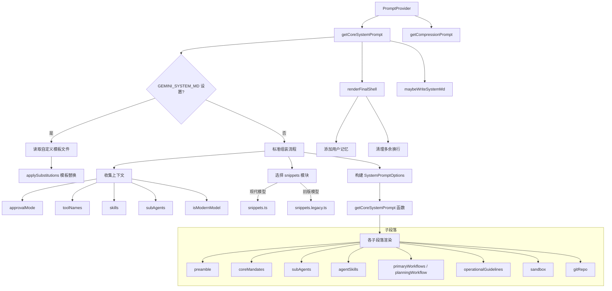

# promptProvider.ts

> 系统提示词生成编排器：收集上下文并组装完整的 system prompt

## 概述

`PromptProvider` 类是系统提示词生成的编排中心。它负责：

1. 收集运行时上下文（批准模式、工具列表、技能、子代理、模型能力等）
2. 选择适当的提示词片段库（现代模型 vs 旧版模型）
3. 组装各个子段落为完整的系统提示词
4. 支持通过环境变量 `GEMINI_SYSTEM_MD` 自定义系统提示词模板
5. 可选地将生成的提示词写入文件（通过 `GEMINI_WRITE_SYSTEM_MD`）

该文件是 prompts 模块对外的核心 API，Agent Loop 通过它获取每次对话所需的系统提示词。

## 架构图

## 主要导出

### `class PromptProvider`

提示词生成器类。

#### `getCoreSystemPrompt(context, userMemory?, interactiveOverride?): string`

生成核心系统提示词。

**流程：**
1. 解析 `GEMINI_SYSTEM_MD` 环境变量
2. 判断模型类型选择对应的 snippets 模块
3. 如果存在自定义模板，读取并进行变量替换
4. 否则收集上下文并通过 `withSection` 守卫机制有条件地启用各段落
5. 调用 `renderFinalShell` 附加用户记忆
6. 清理连续空行
7. 可选地将结果写入文件

**段落守卫：**
- `preamble`: 始终启用
- `coreMandates`: 始终启用
- `primaryWorkflows`: 非 PLAN 模式时启用
- `planningWorkflow`: PLAN 模式时启用
- `interactiveYoloMode`: YOLO + 交互模式时启用
- `gitRepo`: 当前目录是 git 仓库时启用
- `finalReminder`: 仅旧版模型启用

#### `getCompressionPrompt(context): string`

生成历史压缩提示词，用于在对话历史过长时进行压缩摘要。

## 核心逻辑

### 模型感知

通过 `supportsModernFeatures(model)` 判断是否为现代模型。现代模型使用 `snippets.ts`，旧版使用 `snippets.legacy.ts`。两者提供相同的 API 但内容不同。

### 段落守卫机制

`withSection(key, factory, guard)` 方法结合环境变量 `GEMINI_PROMPT_<KEY>` 和运行时条件决定是否启用某段落。环境变量设为 `0` 或 `false` 时强制禁用对应段落。

### 模板替换

当使用自定义系统提示词文件时，支持以下变量替换：
- `${AgentSkills}` -> 技能列表
- `${SubAgents}` -> 子代理列表
- `${AvailableTools}` -> 可用工具列表
- `${<toolName>_ToolName}` -> 工具名称

### 沙箱模式

根据 `SANDBOX` 环境变量确定沙箱模式：
- `sandbox-exec` -> macOS Seatbelt 模式
- 其他非空值 -> 通用沙箱模式
- 未设置 -> 非沙箱模式

## 内部依赖

| 模块 | 用途 |
|------|------|
| `./snippets.js` | 现代模型提示词片段 |
| `./snippets.legacy.js` | 旧版模型提示词片段 |
| `./utils.js` | resolvePathFromEnv, applySubstitutions, isSectionEnabled |
| `../config/memory.js` | HierarchicalMemory 类型 |
| `../policy/types.js` | ApprovalMode 枚举 |
| `../agents/codebase-investigator.js` | CodebaseInvestigatorAgent 名称 |
| `../utils/gitUtils.js` | isGitRepository |
| `../tools/tool-names.js` | 工具名称常量 |
| `../config/models.js` | resolveModel, supportsModernFeatures |
| `../tools/mcp-tool.js` | DiscoveredMCPTool |
| `../tools/memoryTool.js` | getAllGeminiMdFilenames |
| `../config/agent-loop-context.js` | AgentLoopContext 类型 |
| `../utils/paths.js` | GEMINI_DIR |

## 外部依赖

| 包 | 用途 |
|----|------|
| `node:fs` | 同步文件读写 |
| `node:path` | 路径处理 |
| `node:process` | 环境变量访问 |
