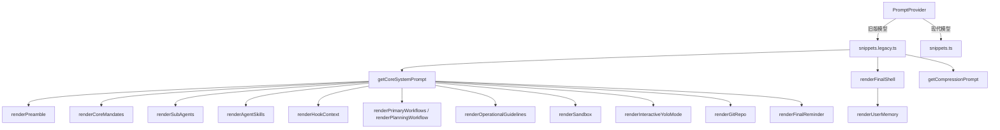

# snippets.legacy.ts

> 旧版模型（非 Gemini 3.x）的系统提示词片段集合

## 概述

`snippets.legacy.ts` 为不支持现代特性的旧版模型提供系统提示词的各个子段落渲染函数。它与 `snippets.ts`（现代版本）提供相同的函数 API，但内容针对旧版模型的能力进行了调整：

- 包含 `finalReminder` 段落（现代版本不需要）
- 缺少某些现代特性（如 `taskTracker`、上下文效率指南）
- 部分段落的措辞和结构略有不同
- `isGemini3` 标志影响 `coreMandates` 和 `operationalGuidelines` 的内容

`PromptProvider` 根据模型能力动态选择使用此文件还是 `snippets.ts`。

## 架构图

## 主要导出

### 接口

| 接口 | 说明 |
|------|------|
| `SystemPromptOptions` | 系统提示词完整选项 |
| `PreambleOptions` | 前言选项（interactive 标志） |
| `CoreMandatesOptions` | 核心准则选项（interactive, isGemini3, hasSkills 等） |
| `PrimaryWorkflowsOptions` | 主要工作流选项 |
| `OperationalGuidelinesOptions` | 操作指南选项 |
| `PlanningWorkflowOptions` | 计划模式工作流选项 |
| `AgentSkillOptions` / `SubAgentOptions` | 技能和子代理描述 |
| `SandboxMode` | 沙箱模式类型 |
| `GitRepoOptions` / `FinalReminderOptions` | Git 仓库和最终提醒选项 |

### 核心函数

#### `getCoreSystemPrompt(options: SystemPromptOptions): string`

组合所有子段落为完整的系统提示词。

#### `renderFinalShell(basePrompt, userMemory?): string`

在基础提示词后附加用户记忆。旧版不支持 `contextFilenames` 参数。

#### `getCompressionPrompt(): string`

生成历史压缩提示词，不支持计划保留（与现代版本的区别）。

### 子段落渲染器

每个 `render*` 函数接受对应的选项对象，返回渲染后的 Markdown 字符串。当选项为 `undefined` 时返回空字符串。

主要差异（与 snippets.ts 对比）：
- `renderCoreMandates`: 含 `isGemini3` 条件分支
- `renderPrimaryWorkflows`: 使用旧版工作流步骤命名（Understand -> Plan 而非 Research -> Strategy）
- `renderOperationalGuidelines`: 含 Shell 输出效率指南
- `renderFinalReminder`: 存在且可用（现代版本不含此段）
- `renderSandbox`: 三种模式（含 'outside'），现代版本仅两种
- `renderUserMemory`: 不支持 contextFilenames

## 核心逻辑

### 工作流差异

旧版使用五步工作流：Understand -> Plan -> Implement -> Verify (Tests) -> Verify (Standards) -> Finalize

现代版本使用三阶段生命周期：Research -> Strategy -> Execution（含 Plan -> Act -> Validate 循环）

### isGemini3 条件

旧版中部分渲染器接受 `isGemini3` 标志来微调输出：
- `coreMandates` 中添加 "Explain Before Acting" 准则
- `operationalGuidelines` 中调整 "No Chitchat" 措辞

## 内部依赖

| 模块 | 用途 |
|------|------|
| `../config/memory.js` | HierarchicalMemory 类型 |
| `../tools/tool-names.js` | 工具名称常量（SHELL_TOOL_NAME, EDIT_TOOL_NAME 等） |

## 外部依赖

| 包 | 用途 |
|----|------|
| `node:process` | process.platform 判断平台 |
