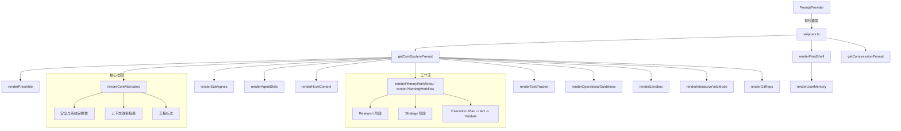

# snippets.ts

> 现代模型（Gemini 3.x+）的系统提示词片段集合

## 概述

`snippets.ts` 是 Gemini CLI 系统提示词的核心内容库，为现代 Gemini 模型提供所有子段落的渲染函数。它定义了 Agent 的角色、行为准则、工作流、操作指南和安全规则。

与旧版 `snippets.legacy.ts` 相比，现代版本的主要特征：
- 更强调 **上下文效率**（减少 token 消耗的搜索和阅读策略）
- 采用 **Research -> Strategy -> Execution** 三阶段生命周期
- 支持 **任务跟踪器**（Task Tracker）集成
- 不含 `finalReminder` 段落和 Shell 输出效率指南
- 支持 **计划模式路由** 的增强型工作流
- `renderUserMemory` 支持 `contextFilenames` 参数
- `getCompressionPrompt` 支持已批准计划的保留

## 架构图

## 主要导出

### 接口

| 接口 | 说明 |
|------|------|
| `SystemPromptOptions` | 系统提示词完整选项（含 taskTracker） |
| `PreambleOptions` | 前言选项 |
| `CoreMandatesOptions` | 核心准则选项（含 contextFilenames） |
| `PrimaryWorkflowsOptions` | 主要工作流选项（含 enableGrep, enableGlob, taskTracker） |
| `OperationalGuidelinesOptions` | 操作指南选项 |
| `PlanningWorkflowOptions` | 计划模式选项（含 taskTracker） |
| `AgentSkillOptions` / `SubAgentOptions` | 技能和子代理描述 |
| `SandboxMode` | 沙箱模式类型 |
| `GitRepoOptions` | Git 仓库选项 |

### 核心函数

#### `getCoreSystemPrompt(options: SystemPromptOptions): string`

组合所有子段落。与旧版相比，新增 `renderTaskTracker()` 调用，移除 `renderFinalReminder`。

#### `renderFinalShell(basePrompt, userMemory?, contextFilenames?): string`

附加用户记忆。支持 `contextFilenames` 参数用于自定义标题。

#### `getCompressionPrompt(approvedPlanPath?): string`

生成历史压缩提示词。当存在已批准计划时，添加 "APPROVED PLAN PRESERVATION" 段落。

### 重要子段落

#### `renderCoreMandates`

现代版本的核心准则分为三大板块：
1. **安全与系统完整性**：凭证保护、源代码控制
2. **上下文效率**：搜索和阅读策略、token 消耗估算、并行操作
3. **工程标准**：约定遵循、技术完整性、专业判断、主动性、测试

#### `renderPrimaryWorkflows`

现代版本工作流：
1. **Research**：系统性映射代码库，验证假设
2. **Strategy**：基于研究制定策略
3. **Execution**：Plan -> Act -> Validate 迭代循环

#### `renderTaskTracker`

新增的任务管理协议，包含：
- 禁止使用心理列表（必须使用工具）
- 收到任务后立即分解
- 计划模式集成
- 依赖管理

#### `renderPlanningWorkflow`

增强版计划模式：
- 自适应工作流（简单/标准/复杂任务）
- 区分 Inquiries 和 Directives
- 计划结构根据复杂度调整

#### `renderOperationalGuidelines`

操作指南包含：
- 高信号输出原则
- 安全规则
- 工具使用并行与顺序指导
- 文件编辑冲突预防
- 确认协议

## 核心逻辑

### 上下文效率策略

这是现代版本最重要的新增内容之一。通过详细的指南教导 Agent 如何最小化 token 消耗：
- 合并轮次（并行搜索和阅读）
- 使用保守的限制和范围
- 避免不必要的大文件读取
- 平衡效率与质量

### 新应用工作流

根据是否启用计划模式分为三个路径：
1. **计划模式启用**：强制使用 ENTER_PLAN_MODE 工具
2. **已批准计划**：直接按计划实施
3. **传统工作流**：交互式需求确认后实施

### formatToolName 辅助函数

所有工具名称通过 `formatToolName` 包装为反引号格式 `` `toolName` ``，确保 Markdown 渲染中的一致性。

## 内部依赖

| 模块 | 用途 |
|------|------|
| `../tools/tool-names.js` | 所有工具名称和参数名常量 |
| `../config/memory.js` | HierarchicalMemory 类型 |
| `../tools/memoryTool.js` | DEFAULT_CONTEXT_FILENAME |

## 外部依赖

无外部依赖。
