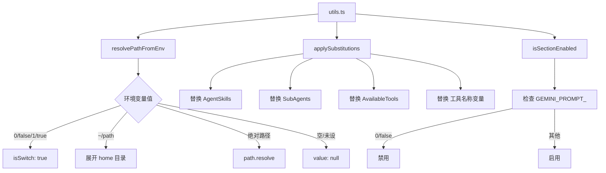

# utils.ts

> 提示词生成的工具函数：路径解析、模板替换和段落开关

## 概述

`utils.ts` 为 prompts 模块提供三个核心工具函数：

1. **环境变量路径解析**：将环境变量值解析为文件路径或布尔开关
2. **模板变量替换**：在自定义系统提示词模板中替换预定义变量
3. **段落开关检查**：通过环境变量控制提示词各段落的启用/禁用

这些函数支持 `PromptProvider` 的灵活配置能力，使系统提示词可以通过环境变量进行精细调节。

## 架构图



## 主要导出

### 类型

#### `ResolvedPath`

```typescript
{
  isSwitch: boolean;   // 是否为布尔开关值
  value: string | null; // 解析后的路径或开关值
  isDisabled: boolean;  // 开关值为 0/false 时为 true
}
```

### 函数

#### `resolvePathFromEnv(envVar?: string): ResolvedPath`

解析环境变量值为路径或开关：

| 输入值 | 结果 |
|--------|------|
| `undefined` / 空 | `{ isSwitch: false, value: null, isDisabled: false }` |
| `'0'` / `'false'` | `{ isSwitch: true, value: '0'/'false', isDisabled: true }` |
| `'1'` / `'true'` | `{ isSwitch: true, value: '1'/'true', isDisabled: false }` |
| `'~/some/path'` | `{ isSwitch: false, value: '/home/user/some/path', isDisabled: false }` |
| `'/abs/path'` | `{ isSwitch: false, value: '/abs/path', isDisabled: false }` |

#### `applySubstitutions(prompt, context, skillsPrompt, isGemini3?): string`

在自定义模板中执行变量替换：

| 变量 | 替换为 |
|------|--------|
| `${AgentSkills}` | 渲染后的技能列表 |
| `${SubAgents}` | 渲染后的子代理列表 |
| `${AvailableTools}` | 工具名称列表（每行一个，前缀 `-`） |
| `${<toolName>_ToolName}` | 对应工具的名称字符串 |

根据 `isGemini3` 选择使用现代或旧版 snippets 的 `renderSubAgents` 函数。

#### `isSectionEnabled(key: string): boolean`

检查环境变量 `GEMINI_PROMPT_<KEY>` 是否允许对应段落启用。仅当值为 `'0'` 或 `'false'` 时返回 `false`，否则（包括未设置）返回 `true`。

## 核心逻辑

### Home 目录展开

对 `~/` 开头的路径，使用 `homedir()` 获取用户主目录并拼接。如果获取主目录失败，返回 `{ value: null }` 作为安全回退。

### 工具名称动态替换

`applySubstitutions` 对所有已注册的工具名称生成形如 `${toolName_ToolName}` 的变量，并使用正则 `\${\\b<varName>\\b}` 进行全局替换，确保只匹配完整的变量名。

## 内部依赖

| 模块 | 用途 |
|------|------|
| `../utils/paths.js` | homedir 函数 |
| `../utils/debugLogger.js` | 调试日志 |
| `./snippets.js` | 现代模型 snippets |
| `./snippets.legacy.js` | 旧版模型 snippets |
| `../config/agent-loop-context.js` | AgentLoopContext 类型 |

## 外部依赖

| 包 | 用途 |
|----|------|
| `node:path` | 路径解析 |
| `node:process` | 环境变量访问 |
