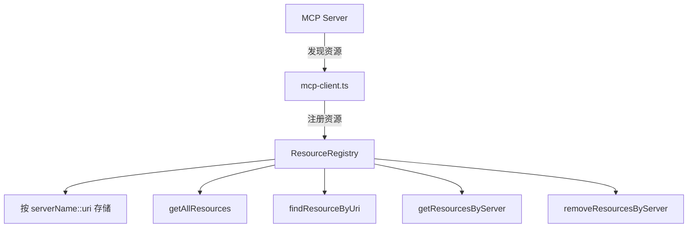

# resources 架构

> MCP 资源注册表，跟踪和管理从 MCP 服务器发现的资源

## 概述

`resources` 模块提供 `ResourceRegistry` 类，用于跟踪从 MCP（Model Context Protocol）服务器发现的资源。这些资源可以是文件、数据源或其他 MCP 服务器提供的可用内容。注册表按服务器名称和 URI 组织资源，支持按服务器批量更新和查询。该模块是 MCP 集成体系的一部分，与 `tools/mcp-client` 协同工作。

## 架构图



## 目录结构

```
resources/
└── resource-registry.ts   # MCP 资源注册表实现
```

## 关键文件

| 文件 | 功能 |
|------|------|
| `resource-registry.ts` | `ResourceRegistry` 类，使用 Map 存储 `MCPResource` 对象，key 格式为 `serverName::uri`。提供 `setResourcesForServer` 批量替换服务器资源、`findResourceByUri` 按 "serverName:uri" 格式查找、`getResourcesByServer` 按服务器过滤、`removeResourcesByServer` 清除服务器资源等方法 |

## 内部依赖

无同包内依赖。`ResourceRegistry` 是一个纯数据容器。

## 外部依赖

| 包 | 用途 |
|------|------|
| `@modelcontextprotocol/sdk` | `Resource` 类型定义（MCP 资源基础接口） |
