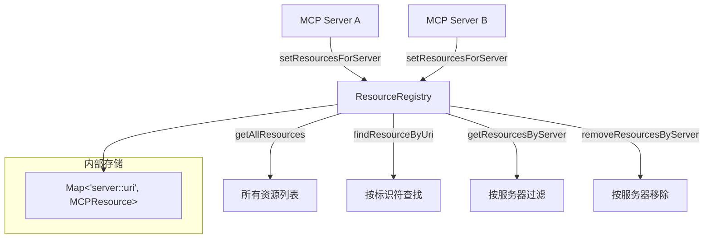

# resource-registry.ts

> MCP 资源注册表，集中管理从 MCP 服务器发现的资源。

## 概述

`resource-registry.ts` 实现了 `ResourceRegistry` 类，用于跟踪和管理从 MCP（Model Context Protocol）服务器发现的资源。每个资源以 `serverName::uri` 为唯一键存储，支持按服务器批量设置/移除资源、按标识符查找、按服务器过滤等操作。该注册表是 MCP 资源集成的核心数据层，允许其他组件（如对话上下文管理器）查询和引用 MCP 资源。

## 架构图

## 主要导出

### 接口与类型

| 名称 | 说明 |
|------|------|
| `MCPResource` | 继承 MCP SDK 的 `Resource`，扩展 `serverName` 和 `discoveredAt` 字段 |
| `DiscoveredMCPResource` | `MCPResource` 的类型别名 |

### 类 `ResourceRegistry`

| 方法 | 签名 | 说明 |
|------|------|------|
| `setResourcesForServer` | `(serverName, resources) => void` | 替换指定服务器的所有资源（先清除旧资源） |
| `getAllResources` | `() => MCPResource[]` | 获取所有已注册资源 |
| `findResourceByUri` | `(identifier: string) => MCPResource \| undefined` | 按 `serverName:uri` 格式的标识符查找资源 |
| `removeResourcesByServer` | `(serverName: string) => void` | 移除指定服务器的所有资源 |
| `clear` | `() => void` | 清空所有资源 |
| `getResourcesByServer` | `(serverName: string) => MCPResource[]` | 获取指定服务器的资源列表，按 URI 排序 |

## 核心逻辑

1. **复合键设计**：使用 `serverName::uri` 作为 Map 键，确保不同服务器的同名资源不会冲突。
2. **原子替换**：`setResourcesForServer` 先调用 `removeResourcesByServer` 清除旧资源，再添加新资源，确保一致性。
3. **发现时间戳**：每批资源添加时记录 `discoveredAt = Date.now()`，支持后续的资源新鲜度判断。
4. **标识符解析**：`findResourceByUri` 解析 `serverName:uri` 格式的标识符（注意查找用单冒号，内部键用双冒号），支持 URI 中包含冒号的情况（如 `file:///data.txt`）。
5. **URI 过滤**：跳过没有 `uri` 字段的无效资源。

## 内部依赖

无。

## 外部依赖

| 包名 | 用途 |
|------|------|
| `@modelcontextprotocol/sdk/types.js` | `Resource` 类型 |
