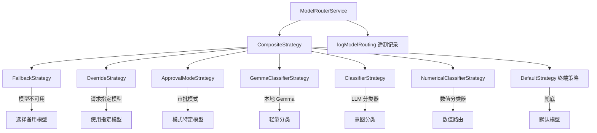

# routing 架构

> 模型路由服务，基于策略链模式动态选择最优 LLM 模型处理请求

## 概述

`routing` 模块实现了一个基于策略链（Chain of Responsibility）模式的模型路由系统。`ModelRouterService` 作为入口，根据请求上下文（会话历史、审批模式、模型可用性等）通过一系列路由策略决定使用哪个模型来处理当前请求。策略按优先级排列：回退策略 -> 覆盖策略 -> 审批模式策略 -> Gemma 分类器 -> 通用分类器 -> 数值分类器 -> 默认策略。该模块还集成了遥测日志记录路由决策。

## 架构图



## 目录结构

```
routing/
├── modelRouterService.ts  # 模型路由服务入口
├── routingStrategy.ts     # 路由策略接口定义
└── strategies/            # 具体路由策略实现
```

## 关键文件

| 文件 | 功能 |
|------|------|
| `modelRouterService.ts` | `ModelRouterService` 类，初始化策略链并执行路由决策，捕获异常并记录遥测日志，返回 `RoutingDecision`（model + metadata） |
| `routingStrategy.ts` | 定义 `RoutingStrategy` 接口（可返回 null 表示跳过）、`TerminalStrategy` 接口（必须返回决策）、`RoutingContext`（history, request, signal）和 `RoutingDecision` 类型 |

## 内部依赖

| 模块 | 用途 |
|------|------|
| `config/config` | Config 配置（获取模型设置、分类器阈值等） |
| `config/models` | resolveModel 模型解析 |
| `core/baseLlmClient` | LLM 客户端（分类器调用） |
| `core/localLiteRtLmClient` | 本地 Gemma 模型客户端 |
| `telemetry/loggers` | logModelRouting 路由遥测 |
| `telemetry/types` | ModelRoutingEvent 事件类型 |
| `utils/debugLogger` | 调试日志 |

## 外部依赖

| 包 | 用途 |
|------|------|
| `@google/genai` | Content, PartListUnion 类型 |
