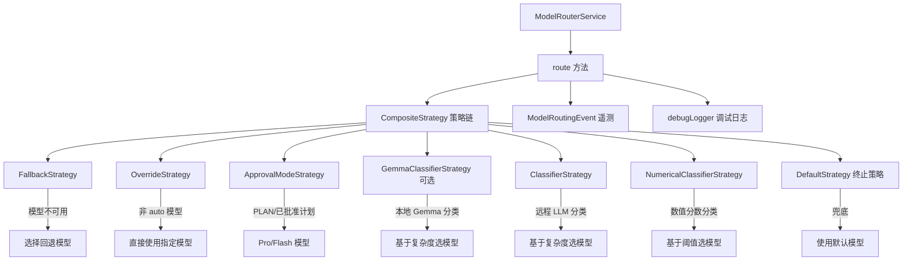

# modelRouterService.ts

> 模型路由服务：集中化的模型选择决策入口

## 概述

`ModelRouterService` 是 Gemini CLI 的模型路由中心服务。它封装了完整的路由策略链，为每次请求决定应使用哪个 LLM 模型（如 Flash 或 Pro）。

核心设计思路：
- 使用 **责任链模式**（Chain of Responsibility）组合多个路由策略
- 通过 `CompositeStrategy` 保证策略链始终有终止点
- 完整的遥测日志记录（延迟、来源、推理过程）
- 优雅的异常处理和回退机制

## 架构图



## 主要导出

### `class ModelRouterService`

模型路由服务类。

#### 构造函数

```typescript
constructor(config: Config)
```

从 Config 初始化，自动构建默认策略链。

#### `route(context: RoutingContext): Promise<RoutingDecision>`

核心路由方法。

**参数：**
- `context`: 包含对话历史、当前请求、中止信号和可选的请求模型

**返回：**
- `RoutingDecision`: 包含选定模型和元数据（来源、延迟、推理过程）

**流程：**
1. 获取数值路由和分类器阈值的配置
2. 执行策略链
3. 记录调试日志
4. 异常时创建回退决策（使用默认模型，标记来源为 `router-exception`）
5. 发送遥测事件

## 核心逻辑

### 策略链初始化顺序

策略按优先级排列，先检查的策略优先级更高：

1. **FallbackStrategy**：检查请求模型是否可用，不可用则选替代
2. **OverrideStrategy**：非 `auto` 模型时直接使用用户指定的模型
3. **ApprovalModeStrategy**：PLAN 模式路由到 Pro，有已批准计划时路由到 Flash
4. **GemmaClassifierStrategy**（可选）：使用本地 Gemma 模型分类任务复杂度
5. **ClassifierStrategy**：使用远程 LLM 分类任务复杂度
6. **NumericalClassifierStrategy**：使用数值分数和阈值分类
7. **DefaultStrategy**（终止策略）：返回配置的默认模型

每个策略返回 `null` 表示"不适用"，交由下一个策略处理。终止策略保证始终返回决策。

### 异常处理

路由过程中的任何异常都会被捕获，生成标记为 `router-exception` 的回退决策。这确保路由失败不会中断用户的对话流程。

### 遥测

每次路由决策都会生成 `ModelRoutingEvent`，记录：
- 选定模型、来源、延迟
- 推理过程
- 是否失败及错误信息
- 当前批准模式
- 数值路由启用状态和阈值

## 内部依赖

| 模块 | 用途 |
|------|------|
| `./routingStrategy.js` | RoutingContext, RoutingDecision, RoutingStrategy 等类型 |
| `./strategies/defaultStrategy.js` | 默认终止策略 |
| `./strategies/classifierStrategy.js` | LLM 分类策略 |
| `./strategies/numericalClassifierStrategy.js` | 数值分类策略 |
| `./strategies/compositeStrategy.js` | 策略组合器 |
| `./strategies/fallbackStrategy.js` | 回退策略 |
| `./strategies/overrideStrategy.js` | 覆盖策略 |
| `./strategies/approvalModeStrategy.js` | 批准模式策略 |
| `./strategies/gemmaClassifierStrategy.js` | Gemma 本地分类策略 |
| `../config/config.js` | Config 类型 |
| `../telemetry/loggers.js` | logModelRouting |
| `../telemetry/types.js` | ModelRoutingEvent |
| `../utils/debugLogger.js` | 调试日志 |

## 外部依赖

无直接外部依赖。
