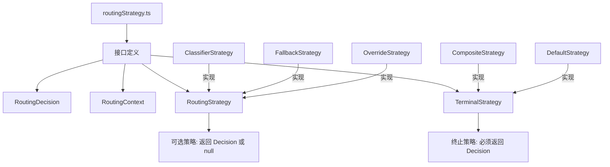

# routingStrategy.ts

> 路由策略的核心接口定义：RoutingDecision、RoutingContext、RoutingStrategy 和 TerminalStrategy

## 概述

`routingStrategy.ts` 定义了模型路由系统的核心抽象。作为路由模块的类型基础，它规定了所有路由策略必须遵循的契约，以及路由决策和请求上下文的数据结构。

设计采用 **策略模式**（Strategy Pattern），通过 `RoutingStrategy` 和 `TerminalStrategy` 两个层级的接口，支持可插拔的路由策略链式组合。

## 架构图



## 主要导出

### `interface RoutingDecision`

路由决策结果。

```typescript
{
  model: string;        // 选定的模型标识符（如 'gemini-2.5-pro'）
  metadata: {
    source: string;     // 决策来源（如 'classifier', 'override'）
    latencyMs: number;  // 路由决策耗时（毫秒）
    reasoning: string;  // 决策推理说明
    error?: string;     // 可选的错误信息
  };
}
```

### `interface RoutingContext`

提供给路由器的请求上下文。

```typescript
{
  history: readonly Content[];  // 完整对话历史
  request: PartListUnion;       // 当前请求内容
  signal: AbortSignal;          // 用于取消 LLM 调用的中止信号
  requestedModel?: string;      // 本轮请求的指定模型（如果有）
}
```

### `interface RoutingStrategy`

所有路由策略必须实现的核心接口。

```typescript
{
  readonly name: string;  // 策略名称
  route(
    context: RoutingContext,
    config: Config,
    baseLlmClient: BaseLlmClient,
    localLiteRtLmClient: LocalLiteRtLmClient,
  ): Promise<RoutingDecision | null>;  // 返回决策或 null（不适用）
}
```

策略返回 `null` 表示此策略不适用于当前请求，应由链中的下一个策略处理。

### `interface TerminalStrategy extends RoutingStrategy`

终止策略接口。与 `RoutingStrategy` 的唯一区别是 `route` 方法的返回类型保证不为 `null`。

```typescript
route(...): Promise<RoutingDecision>;  // 必须返回决策
```

这用于确保 `CompositeStrategy` 的策略链总是能产生一个决策，类型系统强制保证了这一点。

## 核心逻辑

该文件为纯类型定义文件，不包含运行时逻辑。其设计核心在于：

1. **可空返回**：`RoutingStrategy.route()` 返回 `null | RoutingDecision`，使非终止策略可以优雅地"跳过"
2. **终止保证**：`TerminalStrategy` 通过类型约束确保链的最后一个策略必须返回有效决策
3. **上下文传递**：`route` 方法接收 `Config`、`BaseLlmClient` 和 `LocalLiteRtLmClient`，使策略可以访问配置和执行 LLM 调用

## 内部依赖

| 模块 | 用途 |
|------|------|
| `../core/baseLlmClient.js` | BaseLlmClient 类型 |
| `../config/config.js` | Config 类型 |
| `../core/localLiteRtLmClient.js` | LocalLiteRtLmClient 类型 |

## 外部依赖

| 包 | 用途 |
|----|------|
| `@google/genai` | Content, PartListUnion 类型 |
