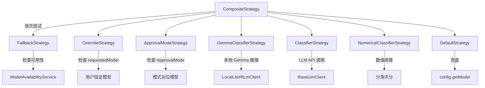

# strategies 架构

> 路由策略的具体实现集合，每个策略负责一种特定的模型选择逻辑

## 概述

`strategies` 目录包含所有路由策略的具体实现。每个策略实现 `RoutingStrategy` 或 `TerminalStrategy` 接口，在 `CompositeStrategy` 的策略链中按顺序尝试，第一个返回非 null 结果的策略即为最终决策。策略涵盖模型可用性回退、用户覆盖、审批模式映射、LLM 分类器路由和默认兜底等场景。

## 架构图



## 目录结构

```
strategies/
├── compositeStrategy.ts              # 组合策略（策略链实现）
├── fallbackStrategy.ts               # 模型可用性回退策略
├── overrideStrategy.ts               # 用户覆盖策略
├── approvalModeStrategy.ts           # 审批模式路由策略
├── gemmaClassifierStrategy.ts        # 本地 Gemma 分类器策略
├── classifierStrategy.ts             # LLM 分类器策略
├── numericalClassifierStrategy.ts    # 数值分类器策略
└── defaultStrategy.ts                # 默认兜底策略
```

## 关键文件

| 文件 | 功能 |
|------|------|
| `compositeStrategy.ts` | `CompositeStrategy` 实现 `TerminalStrategy`，按顺序尝试子策略列表，最后一个必须是终端策略，确保总能返回决策。为决策元数据添加组合路径前缀 |
| `fallbackStrategy.ts` | `FallbackStrategy` 检查当前模型的可用性快照，不可用时选择备用模型 |
| `overrideStrategy.ts` | `OverrideStrategy` 检查请求上下文中是否指定了特定模型（requestedModel），有则直接使用 |
| `approvalModeStrategy.ts` | `ApprovalModeStrategy` 根据当前审批模式（YOLO/Plan/AutoEdit）选择对应的模型 |
| `gemmaClassifierStrategy.ts` | `GemmaClassifierStrategy` 使用本地 Gemma 模型进行快速意图分类，决定使用轻量还是重量级模型 |
| `classifierStrategy.ts` | `ClassifierStrategy` 通过远程 LLM API 调用进行请求分类 |
| `numericalClassifierStrategy.ts` | `NumericalClassifierStrategy` 基于数值评分和阈值的分类路由 |
| `defaultStrategy.ts` | `DefaultStrategy` 实现 `TerminalStrategy`，返回配置中的默认模型作为兜底 |

## 内部依赖

| 模块 | 用途 |
|------|------|
| `config/config` | Config 配置接口 |
| `config/models` | resolveModel 模型名称解析 |
| `core/baseLlmClient` | 远程 LLM 调用客户端 |
| `core/localLiteRtLmClient` | 本地 Gemma 推理客户端 |
| `availability/policyHelpers` | selectModelForAvailability 模型可用性选择 |
| `utils/debugLogger` | 调试日志 |
| `utils/events` | 事件反馈 |

## 外部依赖

无额外外部依赖，使用父模块的依赖。
