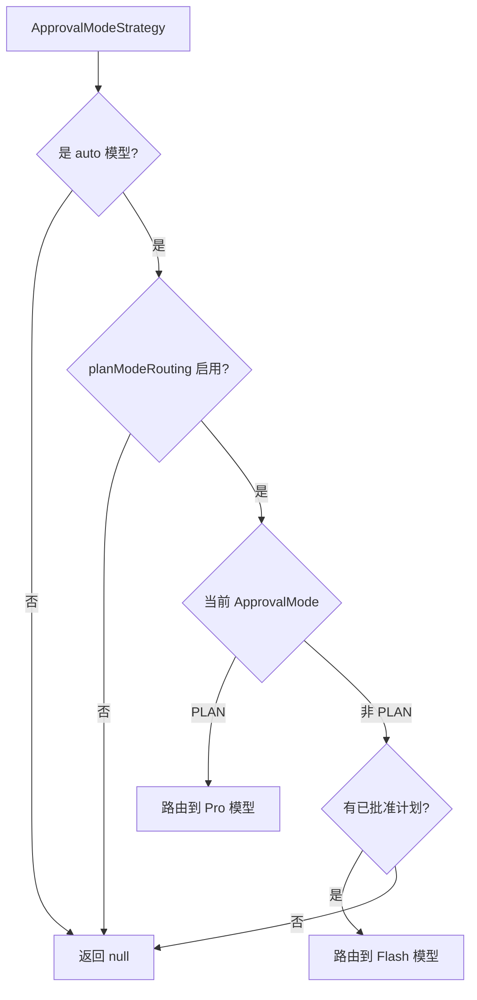

# approvalModeStrategy.ts

> 基于批准模式和计划状态的模型路由策略

## 概述

`ApprovalModeStrategy` 根据当前的批准模式（ApprovalMode）和已批准计划的状态来选择模型：

- **PLAN 模式**：路由到 Pro 模型，用于高质量的计划生成
- **非 PLAN 模式 + 已批准计划**：路由到 Flash 模型，用于高效的计划执行
- **其他情况**：返回 `null`，交由下游策略决定

该策略体现了"计划阶段用强模型思考，执行阶段用快模型行动"的设计理念。

## 架构图

## 主要导出

### `class ApprovalModeStrategy implements RoutingStrategy`

#### 属性

- `name`: `'approval-mode'`

#### `route(context, config, baseLlmClient): Promise<RoutingDecision | null>`

**前置条件（返回 null 的情况）：**
1. 模型不是 `auto` 类型
2. `planModeRouting` 配置未启用

**路由逻辑：**
1. PLAN 模式 -> 使用 `resolveClassifierModel` 解析 Pro 模型
2. 非 PLAN 模式 + 存在 `approvedPlanPath` -> 解析 Flash 模型

## 核心逻辑

### 仅适用于 auto 模型

通过 `isAutoModel(model)` 检查，确保只在自动路由模式下生效。用户明确指定模型时此策略不干预。

### 模型解析

使用 `resolveClassifierModel` 将逻辑别名（`'pro'` / `'flash'`）解析为实际模型标识符，考虑 Gemini 3.1 发布状态和自定义工具模型配置。

## 内部依赖

| 模块 | 用途 |
|------|------|
| `../../config/config.js` | Config 类型 |
| `../../config/models.js` | isAutoModel, resolveClassifierModel, 模型别名 |
| `../../core/baseLlmClient.js` | BaseLlmClient 类型 |
| `../../policy/types.js` | ApprovalMode 枚举 |
| `../routingStrategy.js` | RoutingContext, RoutingDecision, RoutingStrategy |

## 外部依赖

无外部依赖。
