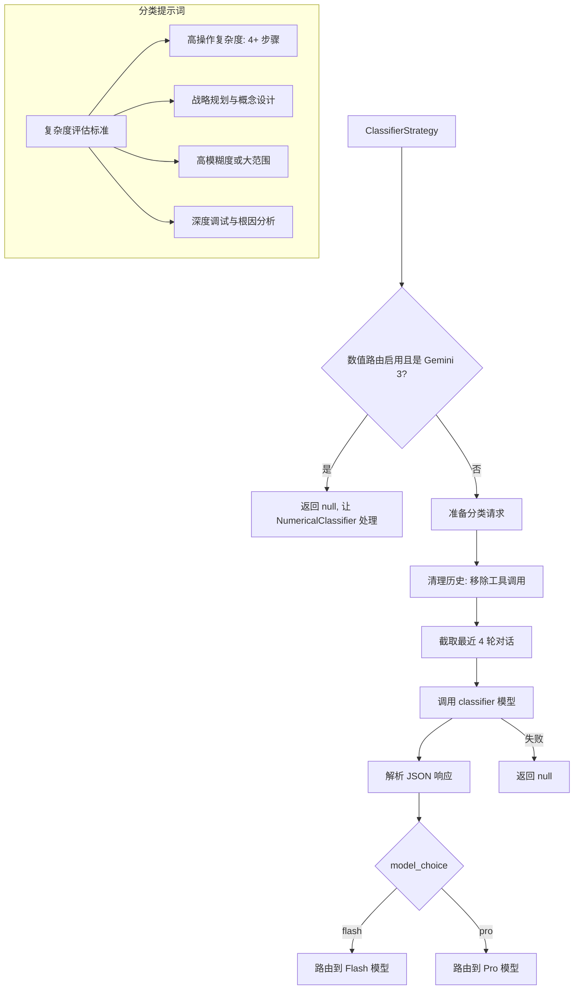

# classifierStrategy.ts

> 基于远程 LLM 的任务复杂度分类路由策略

## 概述

`ClassifierStrategy` 使用一个小型远程 LLM（配置为 `classifier` 模型）来分析用户请求的复杂度，并据此选择 Flash（简单任务）或 Pro（复杂任务）模型。

这是路由系统中的核心智能策略，通过 LLM 对任务进行语义理解来做出路由决策，而非仅依赖简单的规则匹配。

## 架构图

## 主要导出

### `class ClassifierStrategy implements RoutingStrategy`

#### 属性

- `name`: `'classifier'`

#### `route(context, config, baseLlmClient, localLiteRtLmClient): Promise<RoutingDecision | null>`

**前置条件（返回 null 的情况）：**
1. 数值路由已启用且模型是 Gemini 3 系列（让 NumericalClassifierStrategy 处理）
2. 分类器 API 调用失败

**流程：**
1. 从历史中移除工具调用/响应的轮次
2. 截取最近 4 轮清理后的对话
3. 使用结构化 JSON schema 调用 classifier 模型
4. 使用 Zod 验证响应
5. 解析模型选择为实际模型标识符

## 核心逻辑

### 分类系统提示词

采用详细的 rubric 引导分类：

| 分类 | 条件 |
|------|------|
| **COMPLEX (Pro)** | 4+ 步骤的高操作复杂度；战略规划/概念设计；高模糊度/大范围；深度调试 |
| **SIMPLE (Flash)** | 高度具体、有界的任务；1-3 个工具调用；操作简单性优先于措辞的战略性 |

### 历史处理

- 搜索窗口：最近 20 轮
- 清理：过滤掉所有 FunctionCall 和 FunctionResponse 类型的内容
- 上下文：最终取清理后的最近 4 轮

### 响应格式

使用 `@google/genai` 的 `Type` 定义 JSON schema，要求返回：
- `reasoning`: 引用评估标准的步骤式推理说明
- `model_choice`: `'flash'` 或 `'pro'`

### 优雅降级

任何异常（API 错误、解析错误等）都会记录警告并返回 `null`，让策略链继续到下一个策略。

## 内部依赖

| 模块 | 用途 |
|------|------|
| `../../core/baseLlmClient.js` | BaseLlmClient 用于 LLM 调用 |
| `../../utils/promptIdContext.js` | getPromptIdWithFallback |
| `../routingStrategy.js` | 路由策略接口 |
| `../../config/models.js` | resolveClassifierModel, isGemini3Model |
| `../../config/config.js` | Config 类型 |
| `../../utils/messageInspectors.js` | isFunctionCall, isFunctionResponse |
| `../../utils/debugLogger.js` | 调试日志 |
| `../../telemetry/types.js` | LlmRole |

## 外部依赖

| 包 | 用途 |
|----|------|
| `zod` | 响应 schema 验证 |
| `@google/genai` | createUserContent, Type |
