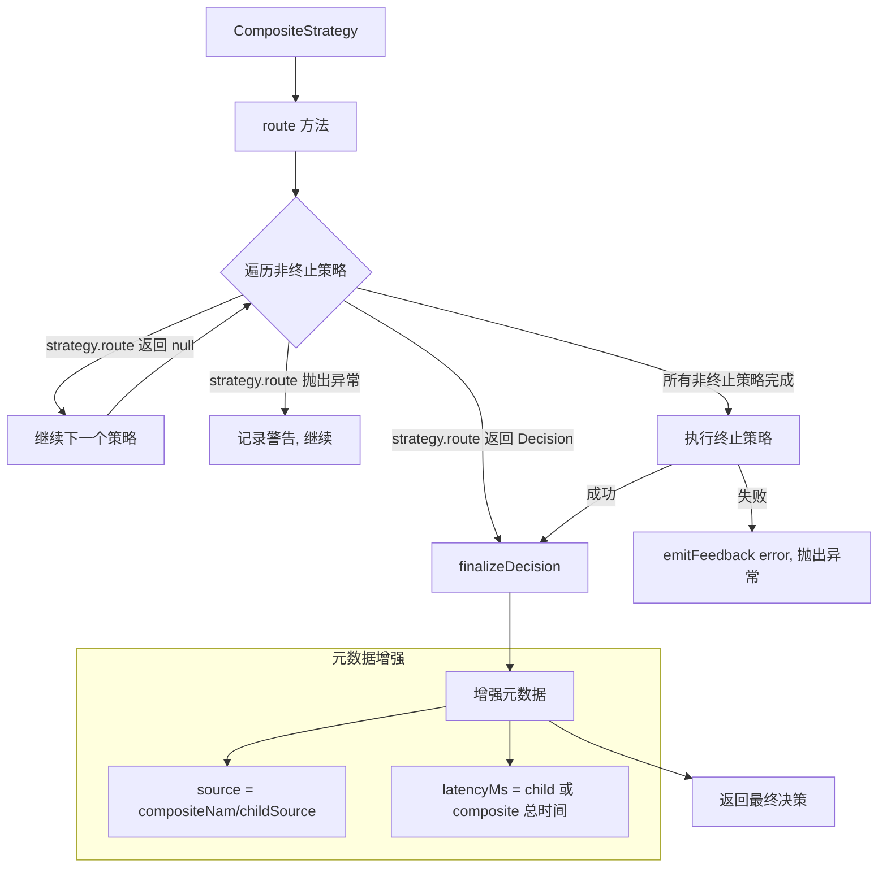

# compositeStrategy.ts

> 策略组合器：以责任链模式串联多个路由策略

## 概述

`CompositeStrategy` 实现了 **责任链模式**（Chain of Responsibility），将多个路由策略按顺序串联。每个策略有机会处理请求，返回 `null` 表示传递给下一个策略。链的最后一个策略必须是 `TerminalStrategy`，保证总能产生决策。

这是路由系统的核心编排组件，被 `ModelRouterService` 用于构建完整的路由管道。

## 架构图



## 主要导出

### `class CompositeStrategy implements TerminalStrategy`

策略组合器类。自身实现 `TerminalStrategy`，保证外部调用者获得非空决策。

#### 构造函数

```typescript
constructor(
  strategies: [...RoutingStrategy[], TerminalStrategy],
  name?: string  // 默认 'composite'
)
```

TypeScript 元组类型 `[...RoutingStrategy[], TerminalStrategy]` 在类型层面保证最后一个元素是终止策略。

#### 属性

- `name`: 策略名称（如 `'agent-router'`）

#### `route(context, config, baseLlmClient, localLiteRtLmClient): Promise<RoutingDecision>`

按顺序尝试每个策略，返回第一个非空决策。终止策略保证总有决策。

## 核心逻辑

### 非终止策略的优雅降级

非终止策略被 try-catch 包围。任何策略抛出异常时：
1. 记录警告日志
2. 继续尝试下一个策略

这确保单个策略的失败不会影响整个路由管道。

### 终止策略的关键性

终止策略不被 try-catch 包围（异常后会重新抛出）。如果终止策略失败，说明路由系统出现了严重问题，此时会通过 `coreEvents.emitFeedback` 发出错误通知。

### 元数据增强

`finalizeDecision` 方法对子策略返回的决策进行增强：
- **source**: 组合为 `compositeName/childSource` 格式（如 `agent-router/classifier`）
- **latencyMs**: 优先使用子策略报告的延迟，若为 0 则使用整个组合策略的总耗时

## 内部依赖

| 模块 | 用途 |
|------|------|
| `../../config/config.js` | Config 类型 |
| `../../core/baseLlmClient.js` | BaseLlmClient 类型 |
| `../../utils/debugLogger.js` | 调试日志 |
| `../../utils/events.js` | coreEvents 错误反馈 |
| `../routingStrategy.js` | RoutingStrategy, TerminalStrategy, RoutingDecision |
| `../../core/localLiteRtLmClient.js` | LocalLiteRtLmClient 类型 |

## 外部依赖

无外部依赖。
