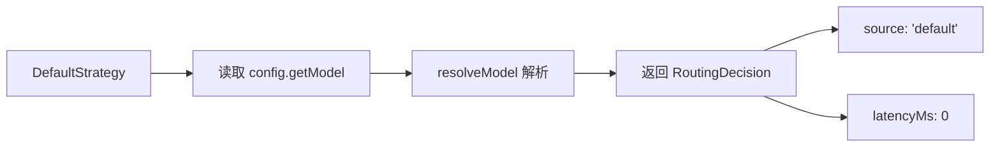

# defaultStrategy.ts

> 默认终止策略：返回配置中的默认模型作为兜底

## 概述

`DefaultStrategy` 是路由策略链中的终止策略（TerminalStrategy）。当所有其他策略都返回 `null`（不适用）时，它作为最终兜底返回配置中的默认模型。

该策略是路由系统正确性的保证：无论发生什么情况，系统总能得到一个有效的模型选择。

## 架构图

## 主要导出

### `class DefaultStrategy implements TerminalStrategy`

#### 属性

- `name`: `'default'`

#### `route(context, config, baseLlmClient, localLiteRtLmClient): Promise<RoutingDecision>`

始终返回有效决策，不会返回 `null`。

**逻辑：**
1. 从 `config.getModel()` 获取默认模型标识符
2. 通过 `resolveModel` 解析（考虑 Gemini 3.1 发布状态）
3. 返回决策，延迟为 0（因为没有 LLM 调用或复杂计算）

## 核心逻辑

此策略不执行任何智能路由。它的存在价值在于：

1. **类型安全**：作为 `TerminalStrategy`，TypeScript 保证 `CompositeStrategy` 的链末尾有一个不返回 null 的策略
2. **系统可靠性**：确保路由系统在所有智能策略都不适用或失败时仍能工作
3. **零开销**：没有 LLM 调用或异步操作的开销

## 内部依赖

| 模块 | 用途 |
|------|------|
| `../../config/config.js` | Config 类型 |
| `../../core/baseLlmClient.js` | BaseLlmClient 类型 |
| `../routingStrategy.js` | RoutingContext, RoutingDecision, TerminalStrategy |
| `../../config/models.js` | resolveModel |
| `../../core/localLiteRtLmClient.js` | LocalLiteRtLmClient 类型 |

## 外部依赖

无外部依赖。
