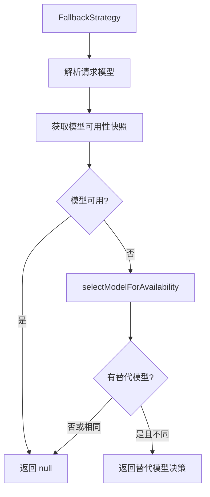

# fallbackStrategy.ts

> 模型可用性回退策略：当请求模型不可用时自动切换到替代模型

## 概述

`FallbackStrategy` 检查请求的模型是否当前可用（通过模型可用性服务）。如果不可用，它会选择一个替代模型。如果模型可用或没有合适的替代，返回 `null` 让下游策略处理。

该策略是路由链中优先级最高的策略（第一个被检查），确保系统不会尝试使用已知不可用的模型。

## 架构图

## 主要导出

### `class FallbackStrategy implements RoutingStrategy`

#### 属性

- `name`: `'fallback'`

#### `route(context, config, baseLlmClient, localLiteRtLmClient): Promise<RoutingDecision | null>`

**返回 null 的情况：**
1. 请求的模型当前可用
2. 没有找到合适的替代模型
3. 替代模型与请求模型相同

**返回决策的情况：**
- 请求模型不可用且找到了不同的替代模型

**决策元数据：**
- `source`: `'fallback'`
- `latencyMs`: 0（仅查询本地状态）
- `reasoning`: 包含不可用原因和替代模型名称

## 核心逻辑

### 可用性检查

通过 `config.getModelAvailabilityService().snapshot(model)` 获取模型的本地可用性快照。这是一个同步操作，不涉及网络调用，因此延迟为 0。

### 模型选择

`selectModelForAvailability` 根据可用性策略选择替代模型。如果选择的替代模型与原请求模型相同（可能发生在可用性信息过时的情况下），则不进行回退。

## 内部依赖

| 模块 | 用途 |
|------|------|
| `../../availability/policyHelpers.js` | selectModelForAvailability |
| `../../config/config.js` | Config 类型 |
| `../../config/models.js` | resolveModel |
| `../../core/baseLlmClient.js` | BaseLlmClient 类型 |
| `../routingStrategy.js` | RoutingContext, RoutingDecision, RoutingStrategy |
| `../../core/localLiteRtLmClient.js` | LocalLiteRtLmClient 类型 |

## 外部依赖

无外部依赖。
