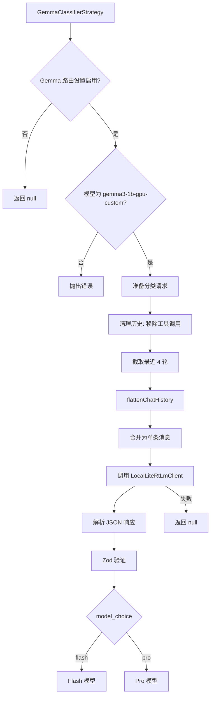

# gemmaClassifierStrategy.ts

> 基于本地 Gemma 模型的任务复杂度分类路由策略

## 概述

`GemmaClassifierStrategy` 使用本地运行的 Gemma 小模型（通过 LiteRT 推理）对用户请求进行复杂度分类。与 `ClassifierStrategy` 使用远程 API 不同，此策略在设备端运行分类器，具有更低的延迟和更好的隐私特性。

当前仅支持 `gemma3-1b-gpu-custom` 模型，其他模型会抛出错误。

## 架构图



## 主要导出

### `class GemmaClassifierStrategy implements RoutingStrategy`

#### 属性

- `name`: `'gemma-classifier'`

#### `route(context, config, baseLlmClient, client): Promise<RoutingDecision | null>`

**前置条件（返回 null 的情况）：**
1. Gemma 路由设置未启用
2. 本地推理调用失败

**前置条件（抛出错误的情况）：**
- 配置的分类器模型不是 `gemma3-1b-gpu-custom`

**流程：**
1. 清理对话历史（移除工具调用/响应）
2. 截取最近 4 轮
3. 将多轮对话扁平化为单条消息格式
4. 使用 `LocalLiteRtLmClient.generateJson` 调用本地模型
5. Zod 验证响应
6. 解析模型选择

## 核心逻辑

### 历史扁平化

Gemma 小模型不擅长处理多轮对话格式。`flattenChatHistory` 方法将历史转换为：

```
#### Chat History:
<前N-1轮的文本内容>

#### Current Request:
"<最后一轮的文本内容>"
```

这种格式更适合小模型理解上下文。

### 系统提示词

使用专门为 Gemma 设计的提示词 `LITERT_GEMMA_CLASSIFIER_SYSTEM_PROMPT`，包含：
- 角色定义："Lead Orchestrator"
- 复杂度评估标准（与 ClassifierStrategy 相同）
- 输出格式要求（JSON schema）
- 6 个分类示例

还有 `LITERT_GEMMA_CLASSIFIER_REMINDER` 作为提醒后缀，帮助模型保持任务焦点。

### 推理限制

`reasoning` 字段被限制为不超过 2 句话，以控制小模型的输出长度。

## 内部依赖

| 模块 | 用途 |
|------|------|
| `../../core/baseLlmClient.js` | BaseLlmClient 类型 |
| `../routingStrategy.js` | RoutingContext, RoutingDecision, RoutingStrategy |
| `../../config/models.js` | resolveClassifierModel |
| `../../config/config.js` | Config 类型 |
| `../../utils/messageInspectors.js` | isFunctionCall, isFunctionResponse |
| `../../utils/debugLogger.js` | 调试日志 |
| `../../core/localLiteRtLmClient.js` | LocalLiteRtLmClient |

## 外部依赖

| 包 | 用途 |
|----|------|
| `zod` | 响应 schema 验证 |
| `@google/genai` | createUserContent, Content, Part 类型 |
