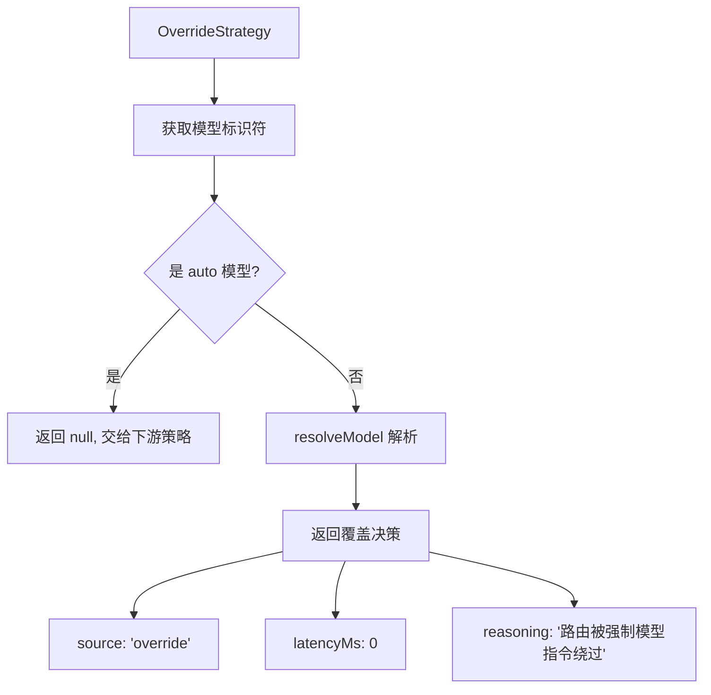

# overrideStrategy.ts

> 模型覆盖策略：用户明确指定模型时绕过所有智能路由

## 概述

`OverrideStrategy` 处理用户明确指定模型的场景。当用户通过命令行参数或配置指定了非 `auto` 的具体模型时，此策略直接使用该模型，跳过所有后续的智能路由策略。

这确保了用户的显式选择始终被尊重，不会被分类器或其他策略覆盖。

## 架构图



## 主要导出

### `class OverrideStrategy implements RoutingStrategy`

#### 属性

- `name`: `'override'`

#### `route(context, config, baseLlmClient, localLiteRtLmClient): Promise<RoutingDecision | null>`

**返回 null 的情况：**
- 模型是 `auto` 类型（应由分类器策略处理）

**返回决策的情况：**
- 模型是具体的模型标识符（如 `'gemini-2.5-pro'`、`'gemini-2.5-flash'`）

**决策内容：**
```typescript
{
  model: resolveModel(overrideModel, ...),
  metadata: {
    source: 'override',
    latencyMs: 0,
    reasoning: `Routing bypassed by forced model directive. Using: ${overrideModel}`,
  }
}
```

## 核心逻辑

### auto 检测

通过 `isAutoModel(model)` 检查模型是否为自动路由模式。`auto` 模型表示用户希望系统自动选择最佳模型，此时应由后续的分类器策略处理。

### 模型解析

使用 `resolveModel` 将可能的别名解析为实际的模型标识符，考虑 Gemini 3.1 发布状态。

### 在策略链中的位置

此策略在 `FallbackStrategy` 之后、`ApprovalModeStrategy` 之前执行。这意味着：
1. 即使用户指定了模型，如果该模型不可用，`FallbackStrategy` 会先介入
2. 如果用户指定了非 auto 模型，后续的分类器和批准模式策略都不会执行

## 内部依赖

| 模块 | 用途 |
|------|------|
| `../../config/config.js` | Config 类型 |
| `../../config/models.js` | isAutoModel, resolveModel |
| `../../core/baseLlmClient.js` | BaseLlmClient 类型 |
| `../routingStrategy.js` | RoutingContext, RoutingDecision, RoutingStrategy |
| `../../core/localLiteRtLmClient.js` | LocalLiteRtLmClient 类型 |

## 外部依赖

无外部依赖。
