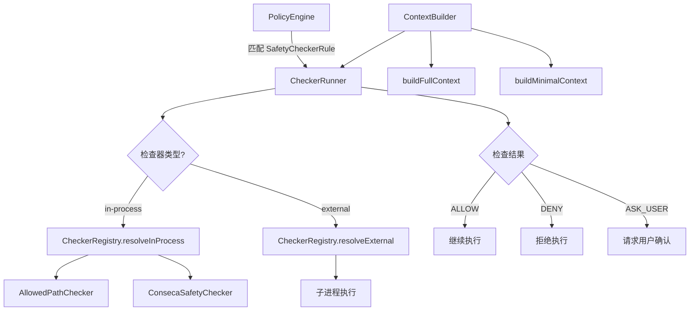

# safety 架构

> 安全检查系统，在工具执行前运行内置和外部安全检查器进行额外验证

## 概述

`safety` 模块提供了一个可扩展的安全检查框架，在 `PolicyEngine` 允许工具调用后，进一步通过安全检查器（Checker）验证工具调用是否安全。系统支持两种检查器类型：内置检查器（in-process，如路径检查和 Conseca 内容安全）和外部检查器（external，通过子进程执行的独立可执行文件）。`CheckerRunner` 负责执行检查器并处理超时，`ContextBuilder` 负责为检查器构建上下文信息，`CheckerRegistry` 负责解析和管理检查器实例。

## 架构图



## 目录结构

```
safety/
├── protocol.ts          # 安全检查协议定义
├── checker-runner.ts    # 检查器执行器
├── context-builder.ts   # 检查上下文构建器
├── registry.ts          # 检查器注册表
├── built-in.ts          # 内置检查器实现
└── conseca/             # Conseca 内容安全子系统
```

## 关键文件

| 文件 | 功能 |
|------|------|
| `protocol.ts` | 定义安全检查协议：`SafetyCheckInput`（protocolVersion、toolCall、context、config）、`SafetyCheckResult`（decision + reason）、`SafetyCheckDecision` 枚举（ALLOW/DENY/ASK_USER）、`ConversationTurn` 对话轮次 |
| `checker-runner.ts` | `CheckerRunner` 类，统一执行内置和外部检查器，支持超时控制（默认 5 秒），外部检查器通过 stdin/stdout 的 JSON 协议通信，使用 Zod 验证返回结果 |
| `context-builder.ts` | `ContextBuilder` 类，从 `AgentLoopContext` 构建检查器所需的上下文（环境信息 + 会话历史），支持全量和最小化上下文模式 |
| `registry.ts` | `CheckerRegistry` 类，管理内置检查器映射（allowed-path、conseca）和外部检查器路径解析，验证检查器名称格式（仅允许小写字母、数字、连字符） |
| `built-in.ts` | 定义 `InProcessChecker` 接口；`AllowedPathChecker` 实现路径安全检查，确保工具操作的文件路径在允许的工作区目录内，支持符号链接解析 |

## 内部依赖

| 模块 | 用途 |
|------|------|
| `policy/types` | SafetyCheckerConfig, InProcessCheckerType, AllowedPathConfig |
| `config/agent-loop-context` | AgentLoopContext 上下文 |
| `utils/debugLogger` | 调试日志 |

## 外部依赖

| 包 | 用途 |
|------|------|
| `@google/genai` | FunctionCall 类型 |
| `zod` | 安全检查结果的 schema 验证 |
| `node:child_process` | spawn 执行外部检查器进程 |
