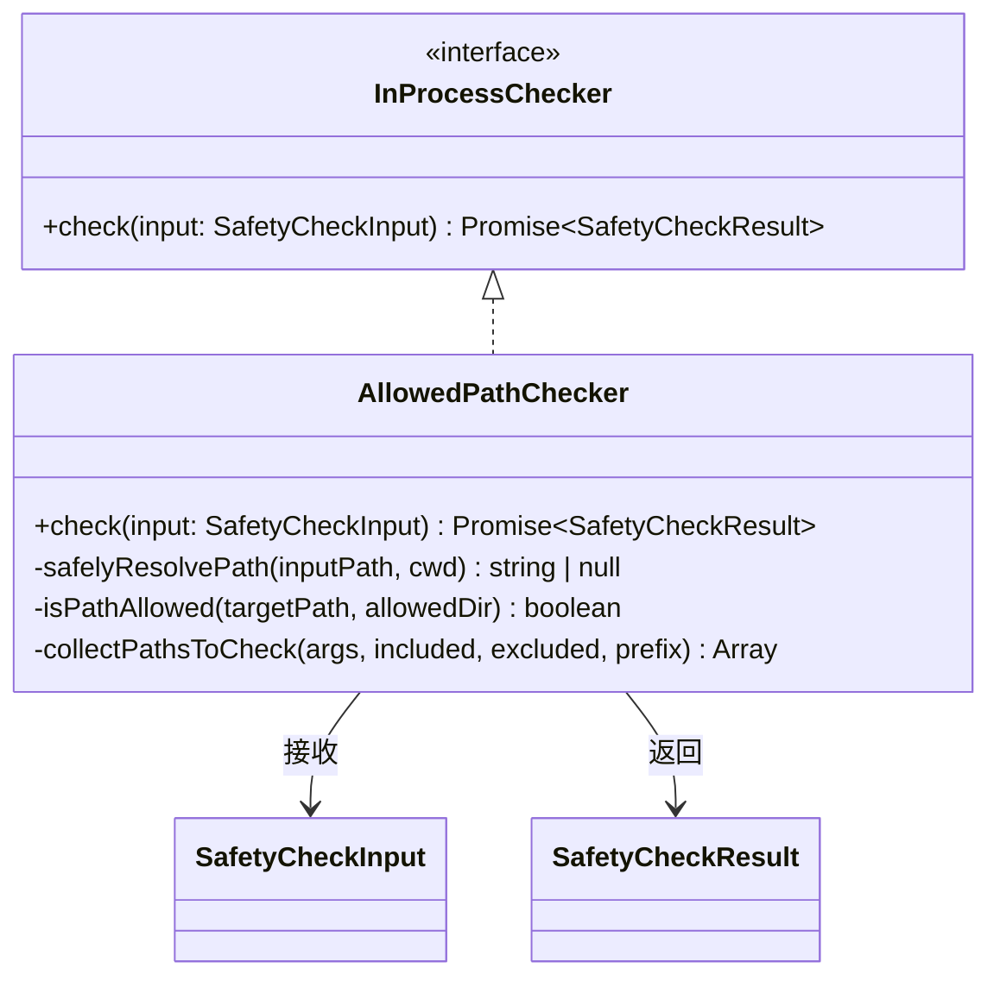

# built-in.ts

> 提供内置的进程内安全检查器，包括文件路径允许列表校验。

## 概述

`built-in.ts` 定义了进程内安全检查器的统一接口 `InProcessChecker`，并实现了 `AllowedPathChecker` ——一个用于验证工具调用中文件路径是否位于允许的工作区目录内的检查器。该检查器通过解析符号链接、递归收集路径参数等方式进行深度校验，是安全子系统中防止路径遍历攻击的关键组件。

## 架构图



## 主要导出

### `interface InProcessChecker`
所有进程内安全检查器的通用接口，只定义一个方法：
```typescript
check(input: SafetyCheckInput): Promise<SafetyCheckResult>
```

### `class AllowedPathChecker implements InProcessChecker`
文件路径校验检查器。

**`check(input: SafetyCheckInput): Promise<SafetyCheckResult>`**
主入口方法：从 `input.context.environment` 构建允许目录列表（`cwd` + `workspaces`），从 `input.config` 读取 `AllowedPathConfig`（包含/排除参数列表），收集工具调用参数中所有疑似路径的值，逐一验证是否在允许范围内。任一路径越界即返回 `DENY`。

## 核心逻辑

### 路径收集：`collectPathsToCheck`
递归遍历工具调用的 `args` 对象，通过以下策略识别路径参数：
1. 参数名在 `includedArgs` 白名单中
2. 参数名包含 `path`、`directory`、`file` 等关键词
3. 参数名为 `source` 或 `destination`
4. 参数名在 `excludedArgs` 黑名单中则跳过
5. 对嵌套对象递归处理，使用 `prefix.key` 形式的完整路径名

### 路径解析：`safelyResolvePath`
对输入路径进行安全解析：
1. 使用 `path.resolve(cwd, inputPath)` 解析为绝对路径
2. 从完整路径向上逐级查找存在的目录
3. 使用 `fs.realpathSync` 解析符号链接，获取真实路径
4. 将剩余的相对部分重新拼接，确保符号链接无法逃逸

### 路径校验：`isPathAllowed`
使用 `path.relative` 计算目标路径相对于允许目录的相对路径，若结果以 `..` 开头或为绝对路径则视为越界。

## 内部依赖

| 模块 | 用途 |
|---|---|
| `./protocol.js` | `SafetyCheckDecision`、`SafetyCheckInput`、`SafetyCheckResult` |
| `../policy/types.js` | `AllowedPathConfig` 配置类型 |

## 外部依赖

| 包 | 用途 |
|---|---|
| `node:path` | 路径解析与相对路径计算 |
| `node:fs` | 文件存在性检查与符号链接解析 |
